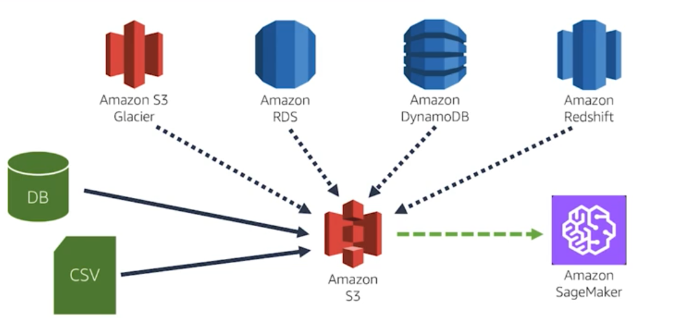
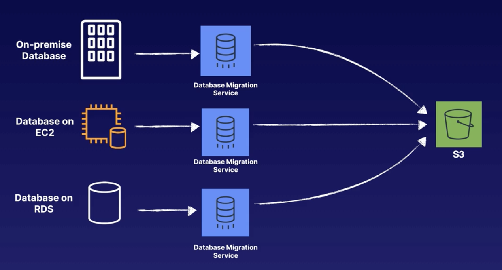
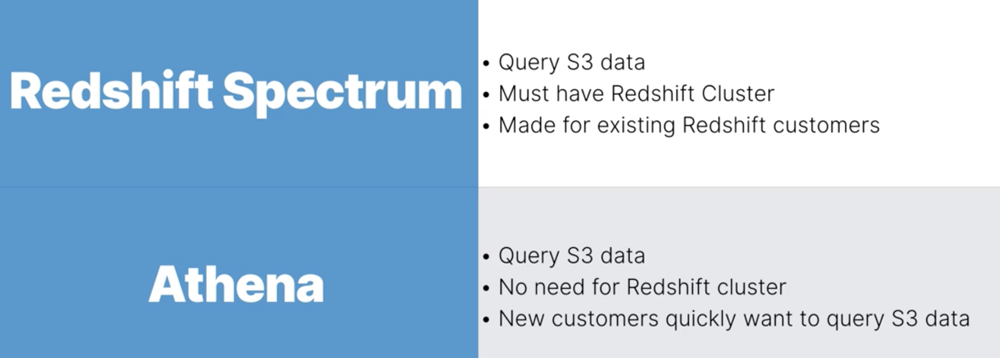
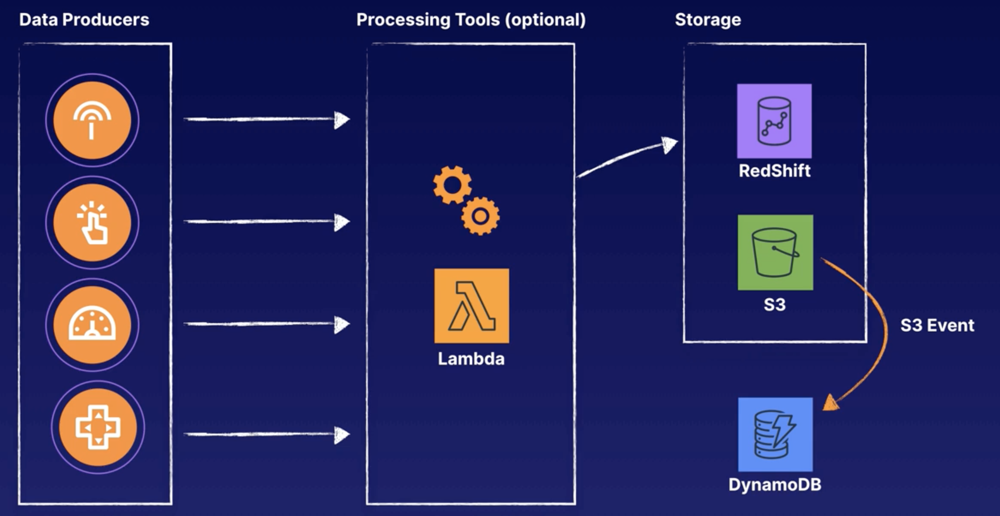
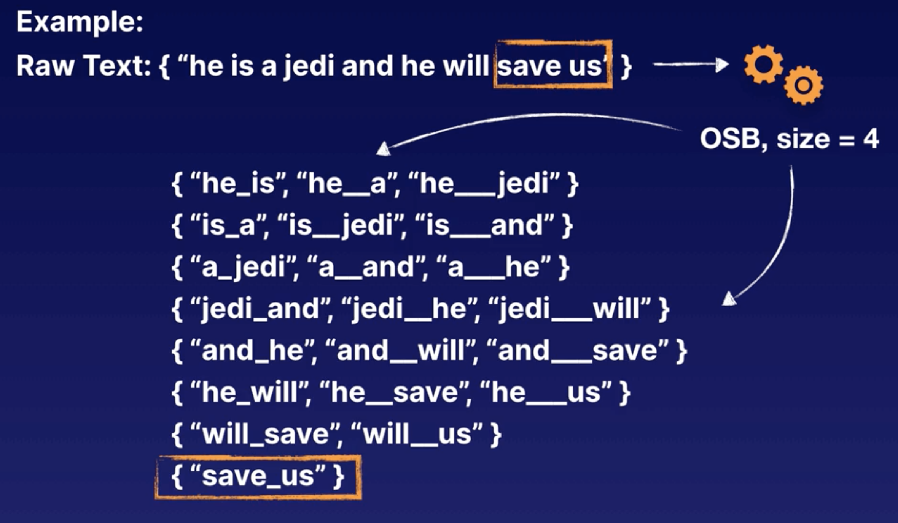
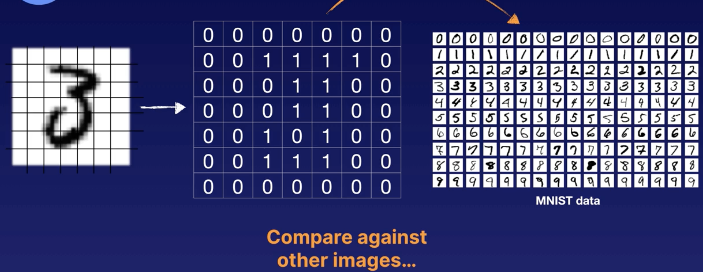
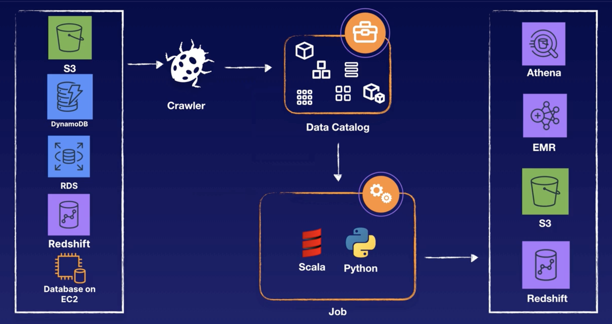
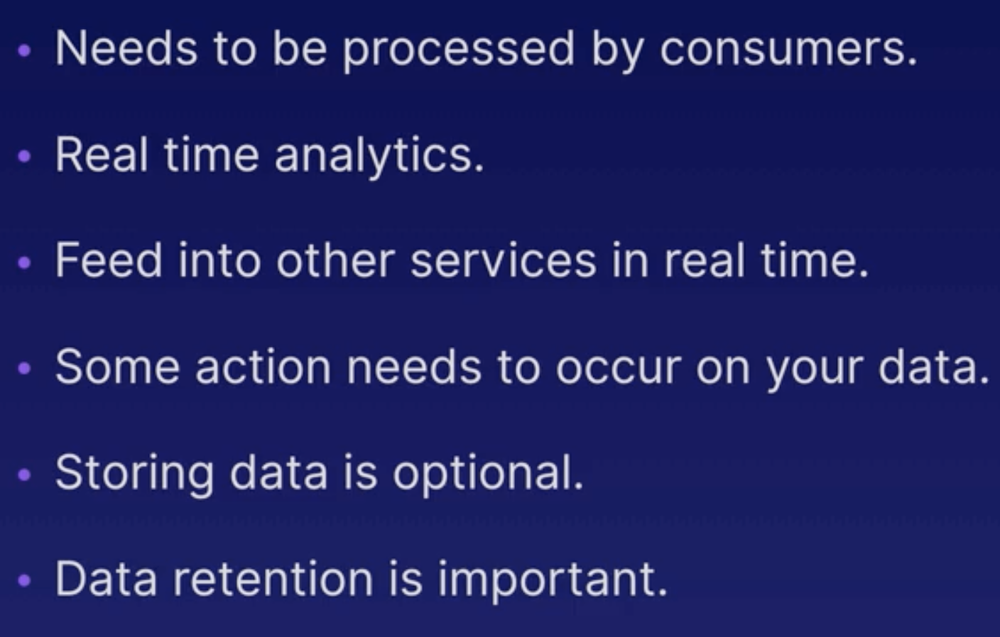
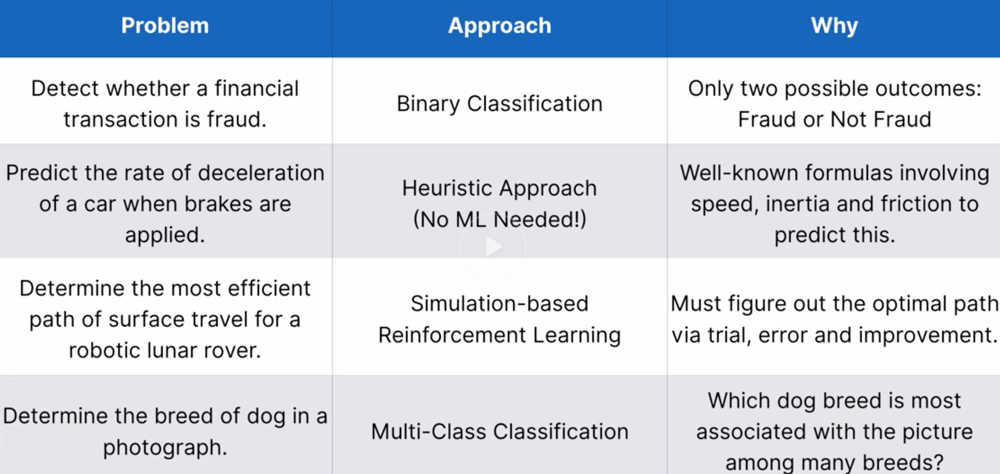

[TOC]


> Solve the toc problem:
>
> option save with naive
>
> pandoc xx.native -t markdown_phpextra -o yy.md

# Exam Logistics

- 170 min
- 65 questions
- Contents:
  - Data engineering - 20%
  - Exploratory data analysis - 24%
  - Modellling - 36%
  - ML implementation & operation  20%
- Type:
  - **Multiple choice**
  - **Multiple response**

建议：
- 先读题，尝试在看选项前答题。
- 找关键词（qualifier & key phrase），并根据此去掉错误选项。
- 实在不会，先跳过。
[exam preparation path](https://aws.amazon.com/training/learning-paths/machine-learning/exam-preparation/)

  
## Part I: Data engineering - 20%
### 🦄Data Collection

#### ✅ Data stores

数据形式[structured, unstruced] -> a centralized repository -> Data Lake



AWS Lake Formation 

Amason S3 storage option for ds processing on AWS

Data warehouse - ETL 

##### **S3**

- object based storage for any type of data.

- Upload: 
  - console
  - different SDK's that AWS offers to upload the files via code or you can use a command line interface to upload your data into S3.

##### RDS

##### Dynamo DB

no SQL data store for non-relational databases that is used to store key value pairs.

- Table 
  - Key : Value -> attribute

##### Redshift

- fully managed clustered petabyte data warehousing solution that congregates data from other data sources like S3, Dynamo DB, and more
- SQL client tools or business intelligence tools, or other analytics tools to query that data and find out important information about your data warehouse.

###### Redshift spectrum

- allows you to query Redshift cluster that has sources of S3 data.

S3 - > redshift spectrum -> quicksight

##### Amazon Timestream

fully managed time series
database service, and it allows you to plug in
business intelligence tools
and run SQL like queries on your time series data.

##### Document DB

 migrate your mongoDB data.


#### ✅ Data Migration tools

##### Data Pipeline
- Built-in activities / template   

 

##### DMS


Database Migration Service
- migrate data between different database platforms.
- for transferring data between two different relational databases but you can also output the results onto S3.
- no transformation except for changing column name

##### Data pipeline VS DMS

- DMS handles all the heavy lifting for you when it comes to resources that are required to transfer the data.
- Data pipeline allows you to set up your resources as needed and handles the transferring of data in more of a custom way

##### Glue


- ETL

- try to find some type of schema or some type of structure in your data.

- can change the output format to any of these formats

  

#### ✅ Data Helper tools

##### EMR

- fully managed Hadoop cluster eco-system that runs on multiple EC2 instances.

- we could use EMR to store mass amounts of files in a distributed file system to use as our input or training data.

##### Amazon Athena

- serverless platform that allows you to run sequel queries on your S3 data.
- set up a table within our data catalog within AWS Glue
  and use Athena to query our S3 data.

##### Redshift Spectrum and Athena?




https://www.youtube.com/watch?v=QZ4LAZCbsrQ

https://www.youtube.com/watch?v=v5lkNHib7bw

https://aws.amazon.com/blogs/big-data/build-a-data-lake-foundation-with-aws-glue-and-amazon-s3/


#### ✅  Streaming Data Collection - Kinesis

##### Kinesis Data Streams


<u>Data Producers -> Kinesis streams</u> 

- to transfer, or load, or stream that data into AWS.

- **shards** - contains all of the streaming data that we want to load into AWS.

  > - Data Record
  >   - partition key
  >   - sequence number
  >   - data blob (payload up to 1 mb)
  > - each shard consists of a sequence of data records, can be ingested at 1000 records per second.
  > - default limit of shards is 500, but we can request increases to unlimited shards.
  > -  transient data store - 24 hours - 7 days

<u>-> data consumers</u> 

- **Kinesis Data Analytics** to run real time SQL queries on our streaming data.

Interaction: 

- Kinesis producer library
  - abstracts some of the lower level commands - higher efficiencies and better performance.
  - Delay
  - The KPL must be installed as a Java application before it can be used with your Kinesis Data Streams.
- Kinesis client library
- Kinesis API (AWS SDK)

> PutRecords is a synchronous send function, so it must be used for the critical events. 
>
> KPL implements an asynchronous send function, incur an additional processing delay of up to RecordMaxBufferedTime within the library (user-configurable). 


##### Kinesis Data Firehose




##### Kinesis Video Streams


##### Kinesis Data Analytics


### 🦄Data Preparation

#### ✅ Categorical Encoding

pandas mapping values

https://pandas.pydata.org/pandas-docs/stable/reference/api/pandas.Series.map.html

pandas one-hot encoding

https://pandas.pydata.org/pandas-docs/stable/reference/api/pandas.get_dummies.html


#### ✅ Text Feature Engineering

###### Bag-of-words

Tokenizeds raw text and creates a statistical representation of the text. 

breaks up text by white space to single words.

###### N-Gram

An extension of Bag-of-Words which produces groups of words of n size

N-gram, size = 2

> Unigram - 1
>
> Bigram - 2
>
> Trigram - 3

##### Orthogonal Sparse Bigram (OSB)

Creates groups of words of size n and outputs every pair of words that includes the first word.



##### **TFIDF**

Term frequency -Inverse Document Frequency - make common words less inportant

**<u>(Num of documents, number of unique n-grams)</u>**

https://scikit-learn.org/stable/modules/generated/sklearn.feature_extraction.text.TfidfVectorizer.html

##### Removing punctuation

##### Lowercase transformation

##### Cartesian product

Creates a new feature from the combination of two or more text or categorical values.


##### Feature engineering dates


#### ✅ Numeric Feature Engineering

##### Feature Scaling

###### Normalization

- <u>outlinears</u> can throw off normalization
- Random cut forest can help outliers
- [0,1]

###### Standardization

- Mean = 0, variance = 1

- value is z score

  

##### Binning

<u>Quantile Binning</u> - creates equal number of bins


pandas qcut (Quantile Binning)

https://pandas.pydata.org/pandas-docs/version/0.22/generated/pandas.qcut.html


#### ✅ Image Feature Engineering

[MNIST](http://yann.lecun.com/exdb/mnist/)



#### ✅ Audio Feature Engineering


#### ✅ Missing values

missing at random (MAR)

missing completely at random (MCAR)

missing not at random (MNAR)


###### fillna

https://pandas.pydata.org/pandas-docs/stable/reference/api/pandas.DataFrame.fillna.html

###### dropna

https://pandas.pydata.org/pandas-docs/stable/reference/api/pandas.DataFrame.dropna.html

#### ✅ Feature selection

###### drop column

https://pandas.pydata.org/pandas-docs/stable/reference/api/pandas.DataFrame.drop.html

###### PCA

### 🦄 AWS Data preparation

##### AWS Glue

Crawler

Data Catelog

Job



**AWS Glue Data Catalog** - crawl through the S3 bucket to find the data that's in there and produce a database catalog that Athena can use to query the data from S3.

- Pyspark
- Scala code
- python shell

Apache Zeppelin, Jupyter

> AWS Glue Release Review
>
> https://acloud.guru/series/release-review/view/111
>
> AWS Glue - How it works
>
> https://docs.aws.amazon.com/glue/latest/dg/how-it-works.html
>
> What is AWS Glue?
>
> https://www.youtube.com/watch?v=qgWMfNSN9f4
>
> Getting Started with AWS Glue ETL
>
> https://www.youtube.com/watch?v=z3HeHlWg88M
>
> Using Apache Spark with Amazon SageMaker - AWS Online Tech Talks
>
> https://www.youtube.com/watch?v=dada2WzCNPM
>
> AWS re:Invent 2018: Integrate Amazon SageMaker with Apache Spark
>
> https://www.youtube.com/watch?v=3tHUGmlclI4
>

##### SageMaker

##### EMR

Apache Spark to integrate directly within SageMaker.
using AWS Glue is going to be the least amount of effort in terms of infrastructure that you have to set up.
Since AWS Glue is fully managed we don't have to spin up the infrastructure like we would have to do in EMR.

##### Athena

run SQL queries on your S3 data.

##### Data Pipeline

process and move data **between different AWS compute services.**
So think about moving data from DynamoDB, RDS, Redshift, sending it through Data Pipeline,
doing our ETL jobs on EC2 instances or within EMR, and then landing the output dataset
on one of our selected target data sources.


### 🦄TIPS

> AWS re:Invent 2018: Building Serverless Analytics Pipelines with AWS Glue
>
> https://www.youtube.com/watch?v=S_xeHvP7uMo
>
> AWS re:Invent 2018: Integrate Amazon SageMaker with Apache Spark
>
> https://www.youtube.com/watch?v=3tHUGmlclI4
>
> Building Serverless ETL Pipelines with AWS Glue
>
> https://www.youtube.com/watch?v=PHYWI4Y9mzs
>
> Build a Data Lake Foundation with AWS Glue and Amazon S3
>
> https://aws.amazon.com/blogs/big-data/build-a-data-lake-foundation-with-aws-glue-and-amazon-s3/
>
> AWS re:Invent 2018: Integrate Amazon SageMaker with Apache Spark
>
> https://www.youtube.com/watch?v=3tHUGmlclI4

#### DC


#### Kinesis

| Kinesis Data <br />Streams                                   | Kinesis Data Firehose                                        | Kinesis Video Streams                                       | Kinesis Data Analytics                                       |
| ------------------------------------------------------------ | ------------------------------------------------------------ | ----------------------------------------------------------- | ------------------------------------------------------------ |
|   |   |  |   |
| Process and evaluate logs immediately<br />Real-time data analytics | Stream and store data from devices<br />Create ETL jobs on streaming data |                                                             | Responsive real-time analytics<br />Stream ETL jobs          |
| Shards. <br />Data retention. [24 hours - 7 days]            | directly output streaming data to s3                         |                                                             | Kinesis Data Analytics gets its input streaming data <br />from Kinesis Data Streams or Kinesis Data Firehose. |
| cannot write data directly to S3                             | delivery system                                              |                                                             | cannot write data directly to S3                             |


https://www.youtube.com/watch?v=M8jVTI0wHFM

#### DP


#### 错题


## Part II: Exploratory data analysis - 24%

#### Relationships


##### Scatter plot

matplotlib Scatter Plot

https://matplotlib.org/api/_as_gen/matplotlib.pyplot.scatter.html

matplotlib Line Charts

https://matplotlib.org/api/_as_gen/matplotlib.pyplot.plot.html

```python
plt.scatter(x = df['x'], y = df['y'])
plt.title('Title')
plt.xlabel('X')
plt.ylabel('Y')
plt.savefig('./images/Scatter_Plot.png',format= 'png',dpi = 1200)
plt.show()

```

##### Bubble plot

https://www.gapminder.org/tools/


#### Comparisons

##### Bar Charts

##### Line Charts


#### Distributions

##### Histogram

adjust bins

https://matplotlib.org/api/_as_gen/matplotlib.pyplot.hist.html

##### Box plot

https://matplotlib.org/api/_as_gen/matplotlib.pyplot.boxplot.html

##### Scatter plot

https://matplotlib.org/api/_as_gen/matplotlib.pyplot.scatter.html


#### Composition

##### Pie chart

https://matplotlib.org/api/_as_gen/matplotlib.pyplot.pie.html

##### Stacked Area Charts

https://matplotlib.org/api/_as_gen/matplotlib.pyplot.stackplot.html

##### Stacked Bar Charts

https://matplotlib.org/gallery/lines_bars_and_markers/bar_stacked.html

#### Heat Map

Show the density

They are used in many different domains and can help show distribution, correlation, relationships and much more insightful information.

#### Amazon QuickSight

BI Tool

Amazon QuickSight Announces General Availability of ML Insights

https://aws.amazon.com/blogs/big-data/amazon-quicksight-announces-general-availability-of-ml-insights/

AWS re:Invent 2018: Introducing ML Insights with Amazon QuickSight

https://www.youtube.com/watch?v=FhI1kVABMF0


## Part III: Modellling - 36%





## Part IV: ML implementation & operation  20%


