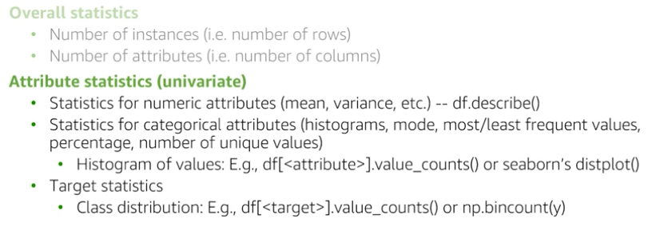
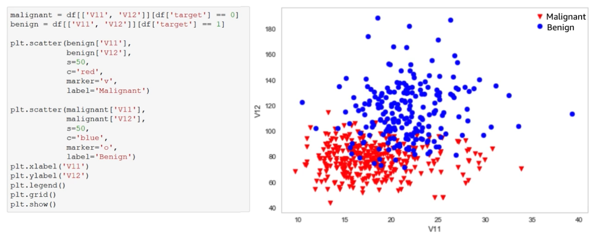
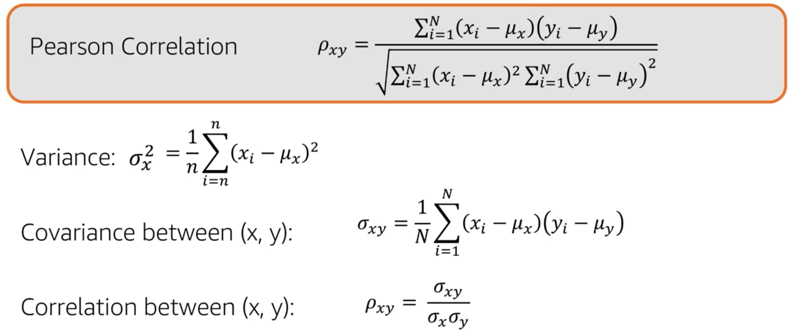
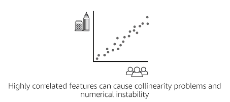
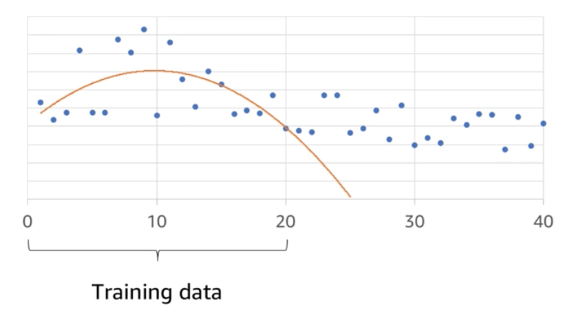
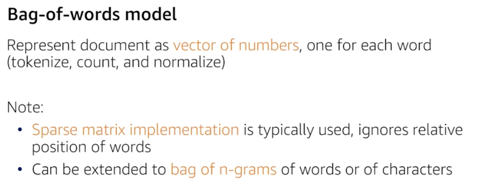
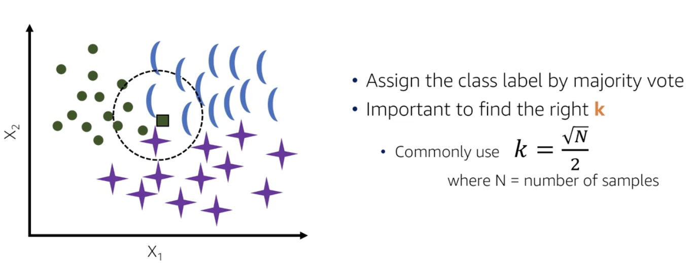
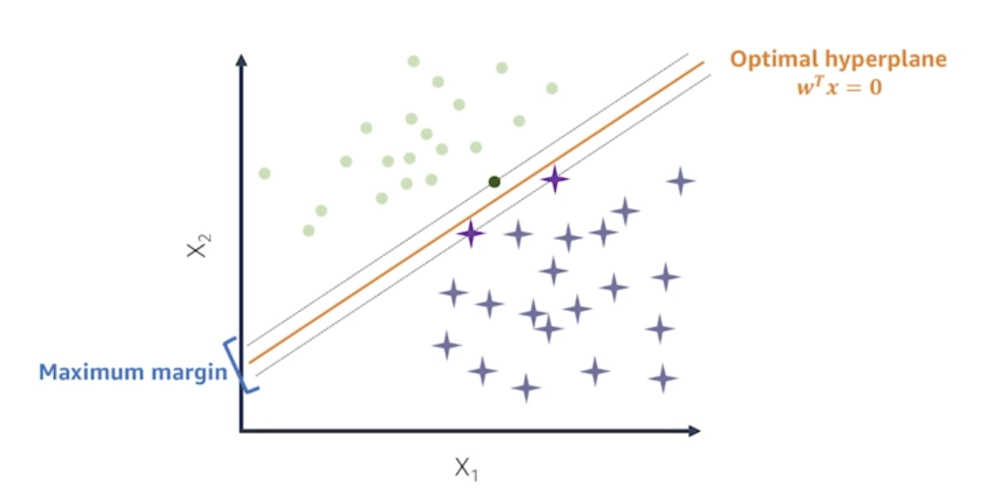
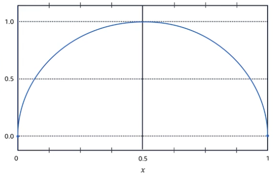
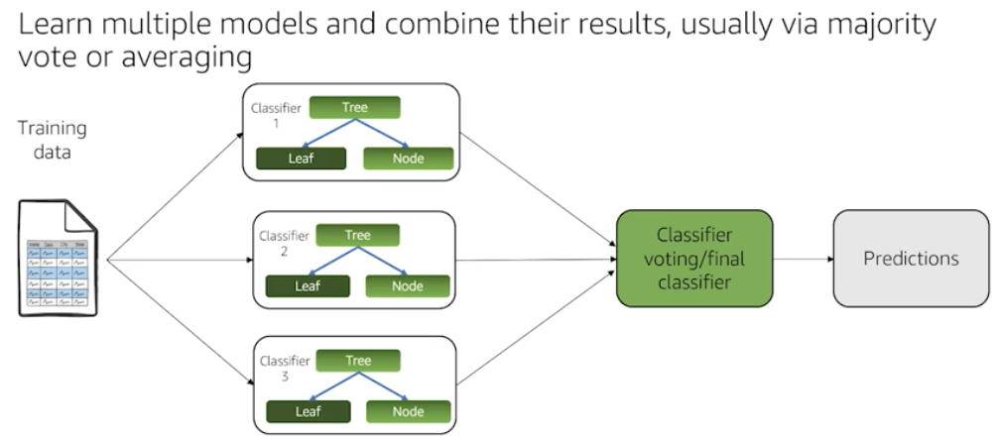

[TOC]


> Solve the toc problem:
>
> option save with naive
>
> pandoc xx.native -t markdown_phpextra -o yy.md

# Exam Logistics

- 170 min
- 65 questions
- Contents:
  - Data engineering - 20%
  - Exploratory data analysis - 24%
  - Modellling - 36%
  - ML implementation & operation  20%
- Type:
  - **Multiple choice**
  - **Multiple response**

建议：
- 先读题，尝试在看选项前答题。
- 找关键词（qualifier & key phrase），并根据此去掉错误选项。
- 实在不会，先跳过。
[exam preparation path](https://aws.amazon.com/training/learning-paths/machine-learning/exam-preparation/)

  
## Part I: Data engineering - 20%
### 1，Create data repositories for ML

数据形式[structured, unstruced] -> a centralized repository -> Data Lake


AWS Lake Formation 

Amason S3 storage option for ds processing on AWS


### 2，Identify and implement a data-ingestion solution
### 3，Identify and implement a data-transformation solution

  

## Part II: Exploratory data analysis - 24%


## Part III: Modellling - 36%

## Part IV: ML implementation & operation  20%


# ML for Business Leaders

## When & How?

### 1,when?

when is machine learning a proporate tool to solve my problem?

what can? what tools?


When not to use?

no data

no groundtruth labels

quick launch

no tolerance for error

### 2, Six questions to ask?

1, what are the made assumption?

2, what is the learning target / hypothesis? (hypothesis testing for large datasets is basic promise for ML)

3, what type of ML problem is it?

4, why did you choose this algorithm? (simpler baseline?)

5, how will you evaluate the model performance?

6, how confident are you that u can generalize the results?		

### 3, How?

how to identify ML opportunities?

**Amazon ML applications:**

recommendations

robotics optimizations

forecasting

search optimizations

delivery routes

Alexa

### 4, Define and scope a ML problem?

ML is the subfield of AI, prevalence of large data sets and massive computational resources has made the domaniance the field of AI. 


| i,define problem                                             | ii, input gathering                                          | iii, output                                                  |
| ------------------------------------------------------------ | ------------------------------------------------------------ | ------------------------------------------------------------ |
|  |  |  |

### 5, Key issues in ML

[AWS: The elements of Data Science](https://aws.amazon.com/training/learning-paths/machine-learning/exam-preparation/)

#### Data quality

consistency of the data (和问题一致么)

accuracy of the data

noisy data (fluctuation in the input and output)

missing data (那些模型对missing敏感？)

outliers 

bias

Variance

#### Model quality

**overfitting and underfitting**


#### Computation speed and scalability

use sagemaker and EC2 

- increase speed

- solve prediction time complexity

- solve space complexity


# The elements of ML

##  🌟ML Process


| Feature Engineering domain specific |  |
| ----------------------------------- | ------------------------------------------------------------ |
| **Parameter Tuning**                | - loss function [和ground truth的差别]<br/>- regularisation [increase the generalization to better fit the data]<br/>- learning parameters (decay rate 控制model学习的快慢) |

### 

## 1️⃣Data prepation 

## Data collection 

### sampling 

[representivity of expected production population: unbiased]

- Random sampling
  - 问题1: rare subpopulation can be underrepresented
  - 解决1：**Stratified sampling**
    - random sampling to each subpopulation.
      - if sampling probability is not the same for each stratum, weights can be used in metrics. 
  - 问题2：
    - sensonality
      - 解决：分层抽样可以减少bias | 可视化
    - trends
      - 解决：比较不同时间段的模型结果 | 可视化
  - 问题3：
    - leakage
      - Train/test bleed: training test data 重复
      - 在train中用了但是production不用

### labeling

**Amazon Mechanical Turk** (human intelligence tasks, 人工标记问卷调查)

- plurality (assign same HIT to multiple labellers)
- gold standard hits (known labels mixed 测试标记表现)
- auditors


## EDA

### Data Schema

pandas merge/join

### Data Statistics

### 🌟descriptive statistics



```python
pd.describe()
pd.hist()
sns.distplot()  #有histogram + ked （smoothing拟合内核密度估计）
df['x'].value_counts()
```
#### basic plots


#### sns.distplot()

核密度估计Kernel Density Estimation(KDE)是在概率论中用来估计未知的密度函数，属于非参数检验方法之一。

直方图：密度函数是不平滑的；密度函数受子区间（即每个直方体）宽度影响很大，同样的原始数据如果取不同的子区间范围，那么展示的结果可能是完全不同的。

[核密度估计kde](https://www.jianshu.com/p/428ae3658f85)


### 🌟correlation

#### scatter | scatter_matrix

scatterplot matrix (linear relationship) - visualize attribute-target and attribute-attribute pairwise relationships.

| Scatter <br>Scatter_matrix      |  |
| ------------------------------- | --------------------------------- |
| **scatter for binary classes**  |  |
| **Correlation matrix heat map** |   <br>|
| **Pearson correlation** |  |

### Data issues

| X        |   |
| -------- | ----------------------------- |
| **x->y** |  |


## 2️⃣Data Processing and Feature Engineering 

### **DP 1:  Encoding Categorical Variables**

##### Categorical

> pandas, dtype = "category"

```python
df['zipcode'] = df.zipcode.astype('category')
df['zipcode'] = pd.Categorical(df.zipcode)
```

##### Ordinal - Map

Ordinal: ordered, use map function

```python
mapping = dict({'N':0,'S':5,'M':10,'L':20})
df['num_garden_size'] = df['garden_size'].map(mapping)
# inplace = True
```

##### Binary - LabelEncoder

[‼ 2个以上的categories可能会出错]

```python
from sklearn.preprocessing import LabelEncoder
la_enc = LabelEncoder()
y = la_enc.fit_transform(df['yes/no'])
```

### **DP 2: Encoding Nominals**

Nominal: unordered - One-hot encoding

encoding nominals with integers is wrong, becasue the ordering and size of the integers are meaningless. 

##### OneHotEncoder 

##### get_dummies

```python
# method 1: one-hot encoding
import pandas as pd
from sklearn.preprocessing import OneHotEncoder
from sklearn.preprocessing import LabelEncoder

df = pd.DataFrame({'Fruits':['Apple','Banana','Banana','Mongo','Banana']})
label_enc = LabelEncoder()
num_type = label_enc.fit_transform(df['Fruits'])
print(num_type)
onehot_enc = OneHotEncoder()
num_type_onehot = onehot_enc.fit_transform(num_type.reshape(-1,1))
print(num_type_onehot.toarray())

'''
[0 1 1 2 1]
[[1. 0. 0.]
 [0. 1. 0.]
 [0. 1. 0.]
 [0. 0. 1.]
 [0. 1. 0.]]
'''

# method 2: pandas get dummies
pd.get_dummies(df)
'''
Fruits_Apple	Fruits_Banana	Fruits_Mongo
0	1	0	0
1	0	1	0
2	0	1	0
3	0	0	1
4	0	1	0
'''
```

##### encoding with many classes

1, define a hierarchy structure: for the zip code, use regions -> states -> city as the hierarchy and choose a specific level to encode the zip code column

2, try to group the levels by similarity to reduce the over number of groups. PCA


### DP 3: Handling Missing Values

##### dropna

Risk of dropping - may lose information in features (undercutting)

```python
df1 = pd.DataFrame({'Fruits':['Apple','Banana','Banana','Mongo','Banana'], 'number':[5, None, 3,None,1]})

# how many missing values for each Column
df1.isnull().sum()

# how many missing values for each Row
df1.isnull().sum(axis =1)

# dropna
df1.dropna(how = 'all')
# thresh - require that many non-NA values
df1.dropna(thresh=3)
df1.dropna(subset = ['Fruits'])
```

##### Imputer

Root cause of missing value - random missing? 

Mean, median, most frequent

```python
from sklearn.preprocessing import Imputer
import numpy as np

arr = np.array([[1,2,3,4],[2,None,5,None],[2,3,4,None]])
# mean from same column 
imputer = Imputer(strategy ='mean')
imputer.fit_transform(arr) 
'''
array([[1. , 2. , 3. , 4. ],
       [2. , 2.5, 5. , 4. ],
       [2. , 3. , 4. , 4. ]])
'''
```

##### advanced imputing methods

MICE(Multiple imputation by chained equations) `sklearn.impute.MICEImputer`

python: KNN impute, SoftImpute, MICE


### Feature Engineering

Create new features that has a better prediction power for the actual problem on hand

##### sklearn.feature_extraction

X^2

X1 & X2

### FE 1: Filtering and Scaling

Image - Remove color channels if color is not important

Audio - Remove frequencies if the power is less than a threshold 

Different range of volume - align different feature to same scale

decision tree and random forests aren't sensitive to features on different scales

> 概率模型（树形模型）不需要归一化，因为它们不关心变量的值，而是关心变量的分布和变量之间的条件概率，如决策树、RF。

### FE 2: Transformation

#### [Compare the effect of different scalers on data with outliers](https://scikit-learn.org/stable/auto_examples/preprocessing/plot_all_scaling.html#sphx-glr-download-auto-examples-preprocessing-plot-all-scaling-py)

#### Scaling: per column
> 1, remove the mean
> 2, scale to unit variance

##### Mean/Variance - [StandardScaler](https://scikit-learn.org/stable/modules/generated/sklearn.preprocessing.StandardScaler.html)

`sklearn.preprocessing.StandardScaler` 高斯：mean 0，variance 1

优：1, algorithm behave better 2, keep outlier information, but reduce impact


```python
from sklearn.preprocessing import StandardScaler

scale = StandardScaler()
arr = np.array([[1,1,1,1],[2,2,2,2],[3,3,3,3]],dtype =float)
scale.fit(arr)

print(scale.mean_)
print(scale.scale_)
print(scale.transform(arr))

# feed new data for the same scaler 
scale.transform([[4,4,4,4]])
```

##### Min/Max  - [MinMaxScaler](MinMaxScaler)

`sklearn.preprocessing.StandardScaler` min:0 max:1

优：robust to small standard deviation


```python
from sklearn.preprocessing import MinMaxScaler
data = [[-1, 2], [-0.5, 6], [0, 10], [1, 18]]
scaler = MinMaxScaler()
scaler.fit(data)
print(scaler.data_max_)
print(scaler.data_min_)
print(scaler.scale_)
'''
[[0.   0.  ]
 [0.25 0.25]
 [0.5  0.5 ]
 [1.   1.  ]]
'''
```

##### Maxabs - [MaxAbsScaler](https://scikit-learn.org/stable/modules/generated/sklearn.preprocessing.MaxAbsScaler.html)

优：doesnt destroy sparsity, dont center throught any measurment


```python
from sklearn.preprocessing import MaxAbsScaler
X = [[ 1., -1.,  2.],
     [ 2.,  0.,  0.],
    [ 0.,  1., -1.]]

transformer = MaxAbsScaler().fit(X)
transformer.transform(X)
'''
array([[ 0.5, -1. ,  1. ],
       [ 1. ,  0. ,  0. ],
       [ 0. ,  1. , -0.5]])
'''
```

##### robust - [RobustScaler](http://scikit-learn.org/stable/modules/generated/sklearn.preprocessing.RobustScaler.html)

优：robust to outliers

​       （因为不需要outliers to calculate median and quantiles）


```python
from sklearn.preprocessing import RobustScaler
>>> X = [[ 1., -2.,  2.],
...      [ -2.,  1.,  3.],
...      [ 4.,  1., -2.]]
>>> transformer = RobustScaler().fit(X)
>>> transformer
RobustScaler()
>>> transformer.transform(X)
array([[ 0. , -2. ,  0. ],
       [-1. ,  0. ,  0.4],
       [ 1. ,  0. , -1.6]])
```


##### Normalization: per row

###### sklearn

[`sklearn.preprocessing.Normalizer`](https://scikit-learn.org/stable/modules/generated/sklearn.preprocessing.Normalizer.html)


### FE 2: Transformation

[`sklearn.preprocessing`PolynomialFeatures](https://scikit-learn.org/stable/modules/generated/sklearn.preprocessing.PolynomialFeatures.html)

```python
import numpy as np
import pandas as pd
from sklearn.preprocessing import PolynomialFeatures
df = pd.DataFrame({'a':np.random.rand(5),'b':np.random.rand(5)})
cube = PolynomialFeatures(degree=2)
cube_features = cube.fit_transform(df)
cols = cube.get_feature_names()
pd.DataFrame(cube_features,columns=cols)

​```
1	x0	x1	x0^2	x0 x1	x1^2
0	1.0	0.737737	0.778589	0.544255	0.574393	0.606200
1	1.0	0.514332	0.649603	0.264537	0.334111	0.421984
2	1.0	0.550124	0.603712	0.302636	0.332116	0.364468
3	1.0	0.260384	0.335987	0.067800	0.087486	0.112888
4	1.0	0.211664	0.154232	0.044802	0.032645	0.023788
​```
```

注意：

- overfitting if the degree is too high 
- sensitive to extrapolation beyond the range
- 考虑Non-polynomial transformations
  - log
  - sigmoid
  - SVM - radio basis function

### FE 3: Text-Based Features

Bag of words model



##### Count vectorizer


##### TFIDF


##### Hashing 


## 3️⃣Model Training, Tuning, and Debugging

### Linear methods

| Linear                                |  |
| ------------------------------------- | ------------------------------------------------------------ |
| **Linear regression (univariate)**    |  |
| **Multivariate LR** Multicollinearity |  |

### Logistic regression

|                               |  |
| ----------------------------- | ------------------------------------------------------------ |
| sigmoid curve                 | is a good representation of probability which is widely used in logistic regression to fit a model. x [-inf, inf] --> y [0 or 1]   |
| Logit function                |   The **logit** function is the inverse of the logistic function.   |
| fit logistic regression model |  |

### Neural Networks

#### 总结
 ReLu Sigmoid Tanh
.
 


activation

- introduce non-linearity 

#### Perceptron

 [input: linear, 1 layer]


#### Neural networks

Scikit-learn: sklearn.neural_network.MLPClassifier


| 特点                                                     | Deep learning frameworks                   |
| -------------------------------------------------------- | ------------------------------------------ |
| Hard to interpret<br>expensive to train, fast to predict | PyTorch<br/>Caffe<br/>TensorFlow<br/>MXnet |

##### CNN - 图片

convolutional neural networks卷积神经网络 - classify images

> input: image, sequence of images
>
> kernels as filters to extract local features, use filters to convolve with the image to create the next layer. 
>
> different layers, channels

power image search services, self-driving cars, automatic video classification systems
voice recognition
natural language processing


卷积层（Convolutional Layer）

[CS231n: Convolutional Neural Networks for Visual Recognition](http://cs231n.stanford.edu/)

[Introducing convolutional networks](http://neuralnetworksanddeeplearning.com/chap6.html#introducing_convolutional_networks)

Convolutional Layer: 

use kernel as features to extract local features

input image, filters to convolve with the image to create the next layer.

Pooling layer: (dimension reduction)

> Aggregate local information
>
> Produces a smaller image

>  (each resulting pixel captures some “global” information)
>
> If object in input image shifts a little, output is the same

max pooling 

avg pooling


convert tensor to vector 

Category

|                               | 输入                                     |                                                     | 输出                                                        |
| :---------------------------- | ---------------------------------------- | --------------------------------------------------- | ----------------------------------------------------------- |
| 卷积层<br>Convolutional Layer | local receptive fields <br>28 x 28 pixel | filter \|kernel过滤器 <br>receptive fields<br>5 x 5 | 激活映射 activation map <br>特征映射 feature map<br>24 x 24 |
| ReLu activation               |                                          |                                                     |                                                             |
| polling layer                 |                                          |                                                     |                                                             |

[Image convolution examples](http://neuralnetworksanddeeplearning.com/chap6.html#introducing_convolutional_networks)

##### RNN/LSTM

Recurrent neural network


- for Feedforward neural network and convolutional, independent input
- Time series, language, sequencial feature

### **K-Nearest Neighbors**

#### 过程

1, Define a distance measure in the training data<br />2, Apply for new data point<br />3, Comment the observation [预测预测目标和所有样本之间的距离或者相似度]<br>4, Identify the nearst neighbors<br />


5, Define the k [Small k, local observation, large k, more global]<br />6, vote 



#### 优点

1, 简单，memory-based, instance based<br />2, 适合低纬（少features）<br />3, 预测中要循环所有样本

#### 缺点


#### KNN二分问题

一般对于二分类问题来说，把K设置为奇数是容易防止平局的现象。但对于多分类来说，设置为奇数未必一定能够防平局。 

```python
from sklearn import datasets
from collections import Counter 
from sklearn.model_selection import train_test_split
import numpy as np

# 导入iris数据
iris = datasets.load_iris()
X = iris.data
y = iris.target
X_train, X_test, y_train, y_test = train_test_split(X, y, random_state=2003)

def euc_dis(instance1, instance2):
    """
    计算两个样本instance1和instance2之间的欧式距离
    instance1: 第一个样本， array型
    instance2: 第二个样本， array型
    """
    dist = np.sqrt(sum((instance1 - instance2)**2))
    return dist
    
    
def knn_classify(X, y, testInstance, k):
    """
    给定一个测试数据testInstance, 通过KNN算法来预测它的标签。 
    X: 训练数据的特征
    y: 训练数据的标签
    testInstance: 测试数据，这里假定一个测试数据 array型
    k: 选择多少个neighbors? 
    """
    # 返回testInstance的预测标签 = {0,1,2}
    distances = [euc_dis(x, testInstance) for x in X]
    kneighbors = np.argsort(distances)[:k]
    count = Counter(y[kneighbors])
    return count.most_common()[0][0]

# 准确率    
predictions = [knn_classify(X_train, y_train, data, 3) for data in X_test]
correct = np.count_nonzero((predictions==y_test)==True)
print ("Accuracy is: %.3f" %(correct/len(X_test)))
```

1, KNN的决策边界

-  随着K值的增加，决策边界确实会变得更加平滑，从而模型变得更加稳定。

- 但稳定不代表，这个模型就会越准确。


2, 交叉验证

将数据分成训练数据和验证数据，选择在验证数据里最好的超参数。

*K-fold Cross Validation* K折交叉验证：已有的数据上重复做多次的验证

- 针对不同的K值，逐一尝试从而选择最好的
- 数据量较少的时候我们取的K值会更大
- 极端情况：*leave_one_out* 留一法交叉验证，也就是每次只把一个样本当做验证数据，剩下的其他数据都当做是训练样本。

2_1 自己写

```python

from sklean.model_selection import KFold
from sklean.neighbors import KNeighborsClassifier

ks = [1,3,5,7,9,11,13,15]
kf = KFold(n_splits = 5, randon_state = True, shuffle = True)

best_k = ks[0]
best_score = 0

for k in ks:
  curr_score = 0
  for train_idx, valid_idx in kf.split(X):
    clf = KNeighborsClassifier(n_neighbors =k)
    clf.fit(X[train_idx], y[train_idx])
    curr_score = curr_score + clf.score(X[valid_idx],y[valid_idx])
  avg_score = curr_score/5
  if avg_score > best_score:
    best_k = k
    best_score = avg_score
  print("current best score is %.2f"%best_score, "best k: %d"%best_k)
print("after cross validation, the final best k is: %d"%best_k)
  

```
2_2 GridSearch


```python
from sklean.model_selection import GridSearchCV
from sklean.neighbors import KNeighborsClassifier

parameters = {'n_neighbors':[1,3,5,7,9,11,13,15]} #knn 的参数
knn = KNeighborsClassifier() #不用指定参数
#GridSearchCV来搜索最好的k。模块内部对每个k值都做了评估

clf = GridSearchCV(knn, parameters, cv = 5)
clf.fit(X,y)

print("best score is: %.2f"%clf.best_score_, " best param: ", clf.best_params_)

```

K: 

- 对于KNN来讲，我们一般从K=1开始尝试，但不会选择太大的K值。而且这也取决于计算硬件，因为交叉验证是特别花时间的过程，因为逐个都要去尝试
- 提高效率：并行化、分布式的处理。针对于不同值的交叉验证之间是相互独立的，完全可以并行化处理。

3_图像识别Knn

http://www.cs.toronto.edu/~kriz/cifar.html

图片是由像素来构成的，比如256*256或者128*128。两个值分别代表长宽上的像素。这个值越大图片就会越清晰。另外，对于彩色的图片，一个像素点一般由三维数组来构成，分别代表的是R,G,B三种颜色。除了RGB，其实还有其他常用的色彩空间。如果使用RGB来表示每一个像素点，一个大小为128*128像素的图片实际大小为128*128*3，是一个三维张量的形式。

图像的读取及表示：

```python
import matplotlib.pyplot as plt

img = plt.imread('.jpg')
print(img.shape)
plt.imshow(img)
```

图像识别挑战：环境因素 （拍摄角度，图像亮度，遮挡物）

1，图像上的特征工程

- 颜色特征（color histogram） 
- SIFT（scale-invariant feature transform）：一个局部的特征，它会试图去寻找图片中的拐点这类的关键点，然后再通过一系列的处理最终得到一个SIFT向量。
- HOG（Histogram of Oriented Gradient）：通过计算和统计图像局部区域的梯度方向直方图来构建特征。由于HOG是在图像的局部方格单元上操作，所以它对图像几何的和光学的形变都能保持很好的不变性。

2， 图像降维

- 这种降维操作会更好地保留图片中重要的信息，同时也帮助过滤掉无用的噪声。
- PCA ：对数据做线性的变换，然后在空间里选择信息量最大的Top K维度作为新的特征值。

阈值的确定：保证各个区间的样本个数是类似的

1，增加模型的非线性型

2，有效处理理数据分布的不均匀的特点。


#### KNN回归问题


1，特征处理

2， Corr() 计算特征之间的相关性。

3，这里StandardScaler用来做特征的归一化，把原始特征转换成均值为0方差为1的高斯分布。

特征的归一化的标准一定要来自于训练数据，之后再把它应用在测试数据上。

4，以及用KNN模型做预测，并把结果展示出来。这里我们使用了y_normalizer.inverse_transform，因为我们在训练的时候把预测值y也归一化了，所以最后的结论里把之前归一化的结果重新恢复到原始状态。 在结果图里，理想情况下，假如预测值和实际值一样的话，所有的点都会落在对角线上，但实际上现在有一些误差。


#### KNN复杂度分析以及KD树

KNN在搜索阶段的时间复杂度是多少？

- 假如有N个样本，而且每个样本的特征为D维的向量。那对于一个目标样本的预测，需要的时间复杂度是O(ND)
- 如何提升？
  - 1，时间复杂度高的根源在于样本数量太多。所以，一种可取的方法是从每一个类别里选出具有代表性的样本。如：对于每一个类的样本做**聚类**，从而选出具有一定代表性的样本。
  - 2， 可以使用近似KNN算法。算法仍然是KNN，但是在搜索的过程会做一些近似运算来提升效率，但同时也会牺牲一些准确率。https://www.cs.umd.edu/~mount/ANN/
  - 3，使用KD树来加速搜索速度
    - KD树看作是一种数据结构，而且这种数据结构把样本按照区域重新做了组织，这样的好处是一个区域里的样本互相离得比较近。
    -   
    - KD树之后，我们就可以用它来辅助KNN的搜索了
      -   为了保证能够找到全局最近的点，我们需要适当去检索其他区域里的点，这个过程也叫作Backtracking。
    - 
       - 最坏情况：backtracking 了所有的节点
         - 


### Linear and Non-Linear Support Vector Machines

#### Linear SVM

##### 总结

Maximize the margin - the distance btw the decision boundry (hyperplane) and the support vectors (data points at the boundary)



popular in research but not in the industry

##### 缺点

max margin picture only applys linerly separable cases

Sklearn.svm.SVC

#### Non-linear SVM

"Kernerlize" function (distance function) to solve nonlinear.

##### 缺点

remember all the data points on the boundary, not memory-efficient and expensive ocmputation.


### **Decision Trees and Random Forests**

#### Entropy


Relative measure of disorder(无序) in the data

**The Classification problem is to reduce the entropy.** 

For each subset of data, the disorder is smaller. 



#### DT 

##### 总结

Training process (build the tree) is utilized to maximizing the IG to choose splits (the impurity of the split [disorder/entropy] sets are lower).

##### sklearn

Sklearn.tree.DecisionTreeClassifier

##### 过程

1, Node are split based on feature that has the largest information gain (IG) between parent node and its split node.

> One metric to quantify IG: 
>
> IG = before-splitting **Entropy** - after-splitting **Entropy** 
>
> [max 1, min 0]
>
> > 1  = 1 (contain both class) - 0 (belong to 1 class)
> >
> > 

2, The splitting procedure can go iteratively at each child node until the end-nodes (leaves) are pure (entropy ~ 0, one class in each node).

- But the splitting procedure usually stops at certain criteria to prevent overfitting.

##### 优点

- Easy to interpret
- Expressive = flexible (啥数据都可)
- Less need for feature transformations

##### 缺点

- susceptible to overfitting
  - Overfitting:
    - "Prune"

#### Gini Impurity


- 最小的 lowest weighted Gini impurity, so it best separates people who like dogs over cats.

  


##### ensemble method | RF

 rf | 集成学习

#### RF

##### sklearn

sklearn.ensemble.RandomForestClassifier

##### 过程

1, Set of decision trees - each classifer (上图) learned from a different randomly sample subset with replacement.

2, Random selection of original features to split on for each tree. 

3, Prediction: avg output probabilities

##### 优点

- Increase diversity throug random selection of training dataset and subset of features for each tree. (X overfitting)

- Reduced variance through averaging.

- Each tree typically does not need to be pruned/

##### 缺点

More expensive to train and run

##### 熵


### **K-Means**

随便的k

centriod

最近的点，移动中心点

Elbow plot - variation stops to change much


### Latent Dirichlet Allocation (LDA)

- Text analysis | unsupervised
- Topic analysis | sentiment analysis

Document -> Topic -> word

Corpus of documents 文集

##### 过程

1, topic analysis 

- remove stop words
- apply "stemming"
- tokenize 
- choose the number of topics k

2, LDA

- Randomly assign topics to each word
- count the words by topic
- Count the topics by document
- ressign the words to topics


## Model Training

### Validation Set

Training data: builds the model

Validation data: evaluates the model performance during debugging and tuning

Testing data: generalizes the final dataset


### **Bias Variance Tradeoff**

#### Bias-variance tradeoff 


##### Bias

- Estimation of the difference between the fitted model and the actual relationship of response and features. 

- **High bias** can cause an algorithm to miss important relationships between features and target outputs resulting in **underfitting**. [predict的值和actual差很多]

> High bias: 
>
> - Try new features
> - Decrease the degree of regularization

##### Variance

- an error from sensitivity to small variations in the training data. 
- **High variance** can cause an algorithm to model random noise in the training set, resulting in **overfitting**. [small change in x can lead large change in the y ]

> High variance: 
>
> - Increase training data
> - Decrease the number of features

##### Bias Variance Tradeoff  


##### 解决 - learning curve

- plot training dataset and validation dataset <u>error</u> or <u>accuracy</u> aganist training set size
- <u>movitivation</u>: detect of the model is underfitting or overfitting, and impact of training data size the error


###### sklearn

**Sklearn.model_selection.learning_curve**

use stratified k-fold cross-validation by default if output is binary or multiclass (preserves percentage of sample in each class)

### Error Analysis

Filter on failed predictions and manually look for patterns

```python
pred = clf.predict(train[col])
error_df = test[pred != test['target']]
```

some common patterns:

- data problems, labeling error
- Under/over represented subclasses
- discriminaating information is not captured in features


## Model Tuning

Overfitting errors can be reduced using regularization - a technique that helps evenly distribute weights among features. 

### Regularization

##### 总结

Adding penalty score for complexity to cost function


##### i.e. linear model

- Idea: large weights correspond to higher complexity -> regularize by penalizing large weights
- 2 types:
  
- Find set of features that minimize the cost function with penalty

##### L1, L2


- **Scale** features first! 
- L1 is useful as feature selection approach since most weights shrink to 0
- L2 is popular, reduce the weight continusly until it reaches 0, but never reach 0

##### sklearn


optimum C parameter: smaller c, stronger regularisation


### **Hyperparameter Tuning**

Hyperparameter: estimator parameter that is not fitted to the data

Technique: 

##### Grid search 

- - <u>sklearn.grid_search.GridSearchCV</u>

  - search for the best parameter combination over a set of parameters
  
  - intensive compution
    
  
  - toy example
  

##### Random search

  - each setting is sampled from a distribution over possible parameter values

### **Feature Extraction**/Selection

> Feature selection: remove features from the model.
>
> Feature extraction: combination of the original features to generate new features.
>

Maps data into smaller feature space that captures the bulk of the information in the data. Data compression.

##### 优点

- Improves computational efficiency
- Reduces curse of dimensionality

##### PCA - pricipal component analysis

-  find patterns based on correlations btw features

- An unsupervised linear approach to feature extration

- Constructs pricipal components: orthogonal axes in direction of maximum variance 

  -  Kernel versions for non-linear data

  linear  non-linear 

- Sklearn.docomposition.PCA
  ```python
  pca = PCA(n_components = 2)
  X_train_pca = pca.fit_transform(X_train_std)
  lr = LogisticRegression()
  lr.fit(X_train_pca)
  ```

##### LDA - Linear discriminant analysis

- Supervised linear approach

- Transforms to subspace that maximizes class separability, dimensionaly reduction of features

- 假设：1, data is normally distributed

  ​            2, data in difference class share the same covariance in the feature space

- Can reduce to at most (#classes -1 )components

sklearn

Sklearn.discriminant_analysis.LinearDiscriminantAnalysis


### **Bagging/Boosting**

Feature extraction and selection are relatively manual processes. Bagging and boosting, which are **automated or semi-automated approaches to determining which features to include.**

#### Bagging

 (bootstrap aggregating)

bootstrap 自助法-抽样

##### 总结

Trainging many models on random subsets of the data and average/vote on the output

- 适用于high variance low bias

> reduce variance
>
> keep bias the same

##### 过程

1, Create a x datasets of size m by **randomly sampling** original dataset with replacement (duplicates allowed)

2, Train weak leaners (decision stumps, logistic regression) on the new datasets to generate prediction

3, choose the output by combining the individual predictions or voting

###### sklearn

- Avg - lr | sklearn.ensemble.BaggingRegressor
- voting - classification | sklearn.ensemble.BaggingClassifier


#### Boosting

##### 总结

Training a sequence of samples to get a strong model

- 适用于high bias low variance 
- mode accepts weights on individual samples

> Often times wins on datasets like most kaggle competitions

###### sklearn

Sklearn.ensemble.AdaBoostClassifier

Sklearn.ensemble.AdaBoostRegressor

Sklearn.ensemble.GradientBoostingClassifier

XGboost - structured datasets

###### 过程

1, Assign strengths to each weak learner

2, Iteratively train learners using **misclassfied** example by the previous weak leaners.


## 4️⃣Model Evaluation and Model Productionizing

### Productizing a ML model

###### aspects of production


###### Types of production environment


### Evaluation 

precision = tp/tp + fp

recall = tp/tp+fn

fpr = fp/ fp + tn


#### Confusion matrix


##### Accuracy  

Used for a balanced data where positive and negative cases are roughly equal.


In classification problem, we open set the interested responses as positive class which ofen time is realted toa rare situation. TN cases are dominated. 

##### Precision 


- TN dwarfs (缩小，矮）the other categories, making accuracy useless for comparing models
- Proportion of positive predictions that are actually correct


##### Recall


**Sensitivity** 

True positive rate (TPR) - the num of correct positives out of the actual positive results. 

- Proportion of positive set that are iddentified as positive
- fraction of negatives that we wrongly predicted

i.e. search engine; precision, quality and how relevant it is; completeness and fraction of relevance

##### Specificity


- num of correct positives out of the predicted positive results


##### F-1 score


- Combination (harmonic mean) of precision and recall

- 

##### ROC AUC


ROC: <br/>1, 选择不同的threshold，TPR 和 FPR 对应关系。<br/>2, FPR越小，TPR越大。全局最优解，能接受的FPR左边能接受的点。<br/>

AUC: auc 面积越大，模型越好

##### i.e.Binary classification

type I: alpha ~ 5%<br/>- type II: beta 1- power<br/>- power ~ 80% [依情况订]<br/> <br> - specificity = TN/TN + FP <br> - FPR = 1- specificity = FP/ TN + FP<br>

- precision：在我们判断是disease中有多少人是真的病了<br>- recall: 在有disease的样本量中，有多少我们可以正确的判断出来。<br>- accuracy: 正确判断的[overall]。<br>

  

#### Cross-validation

##### sklearn

```python
from sklearn.model_selection import train_test_split

train, test = train_test_split(df[col + ['target']], test_size = 0.3)
clf = svm.SVC()
clf.fit(train[col], train['target'])

pred = clf.predict([train[col]])
print(confusion_matrix(y_true=train['target', y_pred = pred, labels = [1,0]]))

print(clf.score(train[col],train['target']))
```

##### K-fold cross-validation

###### 适用

Small sets

small training set -> not enough data for good training

unpresentative test set -> invalid metric

k = [5,10]

###### 过程


1, randomly partition data into k folds

2, for each fold, train model on other k-1 folds and evaluate on that

3, train on all data

4, average metric across k folds eatimates test metric for trained model

##### Leave-one-out 

K = number of data points

Used for very small sets

##### Stratified k-fold

perserve class propotions (equal weight of proportions) in the folds

used for imbalance data

There are seasonlity or subgroups


#### Metric for Linear Regression

##### Mean squared error MSE


sklearn.metrics.mean_squared_error

##### R^2 error

Sklearn.metric.r2_score

###### R^2

 

between 0 and 1

- Fraction of variance accounted for by the model
- standardized version of MSE
- good r^2 are determined by actual problem 

more variables added, larger - > overfitting

- 不是R^2越大越好，注意overfitting

###### Adjusted R^2


- Takes into account of the effect of adding more variables such that it only increases when the added variables have significant effect in prediction

Adjusted r^2 is better metric for multiple variates regression


##### Confidence Interval

###### normal distribution


###### CI


### Using ML Models in Production

#### **Storage**

**Trade-offs**

Read/write speed, size, platform-dependency, ability for schema to evolve. Schema/ data separability, type richness

low latency, Large storage, scalability

Dynamodb, S3

**Model and pipeline persistence**

**Model deployment** 

- A/B testing or shadow testing - helps catch production issue early 

Information security


#### Monitoring and Maintenance

performance deterioration may require new tuning

Validation set may be replaced over time to avoid overfitting

**customer obsession**

"creepiness sniff test" or "the front page of a newspaper test"

#### Using AWS

Pre-trained models

**Sagemaker**

Build

- Pre-built notebooks
- Built-in, high performance algorithm

Train

- One-click training
- Hyperparameter optimization

Deploy

- One-click deployment
- fully managed hosting with auto-scaling

**Amazon rekognition image/video**

**Amazon Lex** 

- chatbots to engage customers

- DL functionalities of ASR (automated speech recognition)
- NLU (natura language understanding)

**Amazon Polly**

Natual sounding text to speech

**Amazon Comprehend**

NLP service

- positive, negative

**Amazon Translate**

voice to text

**Amazon Deeplens**

HD video camera

**AWS Glue** 

- data integration servive for managing ETL 

**Deep scalable sparse tensor network engine** (DSSTNE)


# AWS MLS-C01

### Optimization

Sum of squares vs slope of Model Line

- lowest point on this parabola (抛物线)

Gradient Descent

- Step size - learning rate
- Too large, miss
- Too small, take longer

### Hyperparameter

Learning rate

- Determines the size of the step taken during gradient descent optimization 
- 0-1

Batch size

- The number of samples used to train at any one time
- All (batch) stochastic (one) mini-batch (some ) 
- 32 64 128

Epochs

- The number of times that the algorithm will process the entire training data
- Each epoch contains one or more batches
- Each epoch should see the model get closer to the desired state
- 10, 100, 1000 and up

### RecordIO

"Pipe mode” streams data (As opposed to "Filemode")

• Faster training start times and better throughput

• Most Amazon SageMaker algorithms work best with RecordIO

- Streams data directly from Amazon S3
- Training instances don't need a local disk copy of data

### Math


### Jupyter notebook

Browser <-> Jupyter notebook server <-> Kernel (environment)

​						notebook files

### Framework 

Algorithm

 						Model -> Train -> Predict

Framework 


#### TensorFlow

Tensor - multidimentional array 

Flow - graph

```python
import tensorflow as tf

graph = tf.get_default_graph()
a = tf.constant(10, name = 'a')
b = tf.placeholder(tf.int32, name = 'b') 
c = tf.multiply(a,b, name = 'c')
d = tf.add(c,100, name = 'd')
v_for_b = {b:[
           [1,2,3],
  			   [1,2,3],
]}
graph.get_operations()

with tf.session() as sess:
  result = sess.run(d, feed_dict = v_for_b)
  
print(result)  

[[110 120 130]
 [110 120 130]]
```


#### PyTorch

```python
import torch
x = torch.zeros(2,2) #ones randn
y = x + 10

q = torch.zeros(2,2, requires_grad = True)  # autogradient feature
'''
keep track of the operations that this Tensor
is involved with and it does that by using autograd or autogradient
whose purpose in life once training run has been finished, is to perform the differentiation
required to be able to support the calculation for how to change the weights and biases during that back propagation.
'''
w = q + 10
print(w)
'''
tensor([[10., 10.],
				[10. 10. ]], grad_fn = <addBackward0>)
'''
```

- With Tensorflow, you defined the graph upfront and then you ran it.

- With Pytorch, you're creating the graph essentially as you go along, as long as you have autograd turned on it then stores the process of data as you go along, and it can then map it back.


#### MXNet

```python
import mxnet as nx
from mxnet import nd

x = nd.array([[1,2,3],[4,5,6]], mx.gpu()) # default cpu

'''
. It's got the ability to leave the CPU behind and go to GPUs so differentiated between numpy
'''

from mxnet import autograd
x.attach_grad()

with autograd.record():
  y = x * x + 10
  
y.backward()
x.grad
```

- MXNet in a similar way to pytorch works in a different way to Tensorflow where you get to actually define your graph or define the flow of data through procedural programming in Python and we specifically turn on the auto grad feature to be able to record the process that we perform to our tensors so that we can then perform back propagation by going backward through the calculations and calculating the gradient and so that forms the core of how MXNet works


## AWS Platform

### S3

interaction

API

Rest API

Web endpoints


**Athena** allows us to be able to perform queries over data that we have inside a S3.

**AWS Glue Data Catalog** - crawl through the S3 bucket to find the data that's in there and produce a database catalog that Athena can use to query the data from S3.


**Security**

IAM users and roles

bucket policy

**Encryption**

SSE - server side encryption 

KMS - key management system


Quicksight

AWS Tableau


here we have data inside of S3. 

We've then used glue to go and crawl through that data and to figure out the schema for that data, which it's stored in its own database. 

We've then used that to query that from Athena and we use Athena to do some high level feature engineering to say okay, well, we don't want to have the survey ID. We don't want to have the temperature of when the measurements were taken and we want to add together all the different height elements that we had into a single height measurement and 

then we brought that over into QuickSight so that we could visualize that data all within the Amazon Web Services ecosystem and all completely serverless. 

So this is a demonstration of how you can use Amazon Quicksight.


Polly

speak 2 text


Transcribe


#### lifecycle configurations 

bootstrap scripts that you can use on EC2 instances.

can run when you create your Jupyter notebook instances