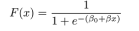
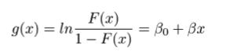
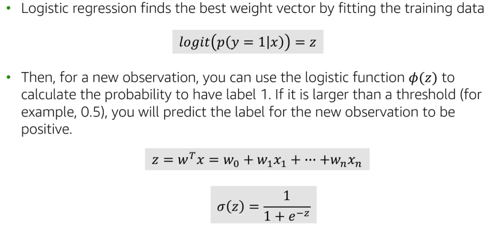

[TOC]


# Exam Logistics

- 170 min
- 65 questions
- Contents:
  - Data engineering - 20%
  - Exploratory data analysis - 24%
  - Modellling - 36%
  - ML implementation & operation  20%
- Type:
  - **Multiple choice**
  - **Multiple response**

建议：

- 先读题，尝试在看选项前答题。

- 找关键词（qualifier & key phrase），并根据此去掉错误选项。

- 实在不会，先跳过。

[exam preparation path](https://aws.amazon.com/training/learning-paths/machine-learning/exam-preparation/)

  


## Part I: Data engineering - 20%
### 1，Create data repositories for ML

数据形式[structured, unstruced] -> a centralized repository -> Data Lake


AWS Lake Formation 

Amason S3 storage option for ds processing on AWS


### 2，Identify and implement a data-ingestion solution
### 3，Identify and implement a data-transformation solution

  

## Part II: Exploratory data analysis - 24%


## Part III: Modellling - 36%

## Part IV: ML implementation & operation  20%


# ML for Business Leaders

## When & How?

### 1,when?

when is machine learning a proporate tool to solve my problem?

what can? what tools?


When not to use?

no data

no groundtruth labels

quick launch

no tolerance for error

### 2, Six questions to ask?

1, what are the made assumption?

2, what is the learning target / hypothesis? (hypothesis testing for large datasets is basic promise for ML)

3, what type of ML problem is it?

4, why did you choose this algorithm? (simpler baseline?)

5, how will you evaluate the model performance?

6, how confident are you that u can generalize the results?		

### 3, How?

how to identify ML opportunities?

**Amazon ML applications:**

recommendations

robotics optimizations

forecasting

search optimizations

delivery routes

Alexa

### 4, Define and scope a ML problem?

ML is the subfield of AI, prevalence of large data sets and massive computational resources has made the domaniance the field of AI. 


| i,define problem                                             | ii, input gathering                                          | iii, output                                                  |
| ------------------------------------------------------------ | ------------------------------------------------------------ | ------------------------------------------------------------ |
|  |  |  |

##  ML Process


| Feature Engineering domain specific |  |
| ----------------------------------- | ------------------------------------------------------------ |
| **Parameter Tuning**                | - loss function [和ground truth的差别]<br/>- regularisation [increase the generalization to better fit the data]<br/>- learning parameters (decay rate 控制model学习的快慢) |


## Evaluation 

#### 1, Overfitting vs underfitting（generalize more toward unseen data）

- use validation error 

- using training error -> overfitting, lack of feature/information -> undercutting

#### 2, Bias-variance tradeoff [supervised]


#### 3, evaluation matrix

| 模型       | evaluation                                      |                      |
| ---------- | ----------------------------------------------- | -------------------- |
| Regression |  | -RMSE，MAPE 越大越好<br> -R^2 越大越好 |
| Classification | - confusion matrix <br/> -precision recall  | - precision: how correct we are on ones we predictect would be positive <br/> - recall: fraction of negatives that we wrongly predicted<br>i.e. search engine; precision, quality and how relevant it is; completeness and fraction of relevance |
| Binary classification 例子 | - type I: alpha ~ 5%<br/>- type II: beta 1- power<br/>- power ~ 80% [依情况订]<br/> <br> - specificity = TN/TN + FP <br> - FPR = 1- specificity = FP/ TN + FP<br> \ | - precision：在我们判断是disease中有多少人是真的病了<br>- recall: 在有disease的样本量中，有多少我们可以正确的判断出来。<br>- accuracy: 正确判断的[overall]。<br> |
| ROC <br>AUC |  | ROC: <br/>1, 选择不同的threshold，TPR 和 FPR 对应关系。<br/>2, FPR越小，TPR越大。全局最优解，能接受的FPR左边能接受的点。<br/> AUC: auc 面积越大，模型越好 |

### Key issues in ML

[AWS: The elements of Data Science](https://aws.amazon.com/training/learning-paths/machine-learning/exam-preparation/)

#### Data quality

consistency of the data (和问题一致么)

accuracy of the data

noisy data (fluctuation in the input and output)

missing data (那些模型对missing敏感？)

outliers 

bias

Variance

#### Model quality

**overfitting and underfitting**


#### Computation speed and scalability

use sagemaker and EC2 

- increase speed

- solve prediction time complexity

- solve space complexity


# The elements of ML

## Supervised learning:

### Linear methods:

| Linear                                   |                              |
| ---------------------------------------- | ----------------------------------------------------------- |
| **Linear regression (univariate)**       |    |
| **Multivariate LR**<br>Multicollinearity |  |

### Logistic regression

|                               |  |
| ----------------------------- | ------------------------------------------------------------ |
| sigmoid curve                 | is a good representation of probability which is widely used in logistic regression to fit a model. x [-inf, inf] --> y [0 or 1] <br> |
| Logit function                |  <br>The **logit** function is the inverse of the logistic function. <br/> |
| fit logistic regression model |  |


problem formulation

## data collection - EDA 

### sampling 

[representivity of expected production population: unbiased]

- Random sampling
  - 问题1: rare subpopulation can be underrepresented
  - 解决1：**Stratified sampling**
    - random sampling to each subpopulation.
      - if sampling probability is not the same for each stratum, weights can be used in metrics. 
  - 问题2：
    - sensonality
      - 解决：分层抽样可以减少bias | 可视化
    - trends
      - 解决：比较不同时间段的模型结果 | 可视化
  - 问题3：
    - leakage
      - Train/test bleed: training test data 重复
      - 在train中用了但是production不用

### labeling

**Amazon Mechanical Turk** (human intelligence tasks, 人工标记问卷调查)

- plurality (assign same HIT to multiple labellers)
- gold standard hits (known labels mixed 测试标记表现)
- auditors


### Data Schema

pandas merge/join

### Data Statistics

### 🌟descriptive statistics


```python
pd.describe()
pd.hist()
sns.distplot()  #有histogram + ked （smoothing拟合内核密度估计）
df['x'].value_counts()
```
##### basic plots


##### sns.distplot()

核密度估计Kernel Density Estimation(KDE)是在概率论中用来估计未知的密度函数，属于非参数检验方法之一。

直方图：密度函数是不平滑的；密度函数受子区间（即每个直方体）宽度影响很大，同样的原始数据如果取不同的子区间范围，那么展示的结果可能是完全不同的。

[核密度估计kde](https://www.jianshu.com/p/428ae3658f85)


#### 🌟correlation

##### scatter | scatter_matrix

scatterplot matrix (linear relationship) - visualize attribute-target and attribute-attribute pairwise relationships.


| Scatter <br>Scatter_matrix      |  |
| ------------------------------- | --------------------------------- |
| **scatter for binary classes**  |  |
| **Correlation matrix heat map** |   <br>|
| **Pearson correlation** |  |


### Data issues

| X        |   |
| -------- | ----------------------------- |
| **x->y** |  |


## Data Processing and Feature Engineering


### **Data Preprocessing:  Encoding Categorical Variables**

### **Data Preprocessing: Encoding Nominals**

### **Data Preprocessing: Handling Missing Values**

### **Feature Engineering**

### **Feature Engineering: Filtering and Scaling**

### **Feature Engineering: Transformation**

### **Feature Engineering: Text-Based Features**


## Model Training, Tuning, and Debugging

### **Supervised Learning: Neural Networks**

### **Supervised Learning: K-Nearest Neighbors**

### **Supervised Learning: Linear and Non-Linear Support Vector Machines**

### **Supervised Learning: Decision Trees and Random Forests**

### Model Training: Validation Set

### **Model Training: Bias Variance Tradeoff**

### **Model Debugging: Error Analysis**

### **Model Tuning: Regularization**

### **Model Tuning: Hyperparameter Tuning**

### **Model Tuning**

### **Model Tuning: Feature Extraction**

### **Model Tuning: Feature Selection**

### **Model Tuning: Bagging/Boosting**

