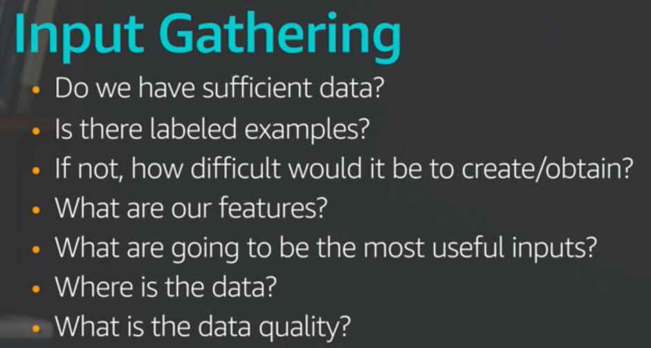
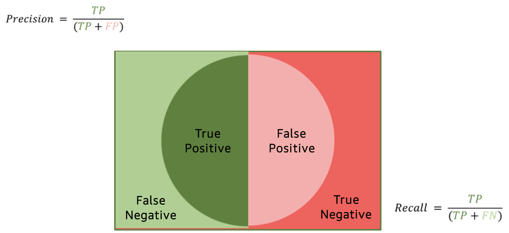
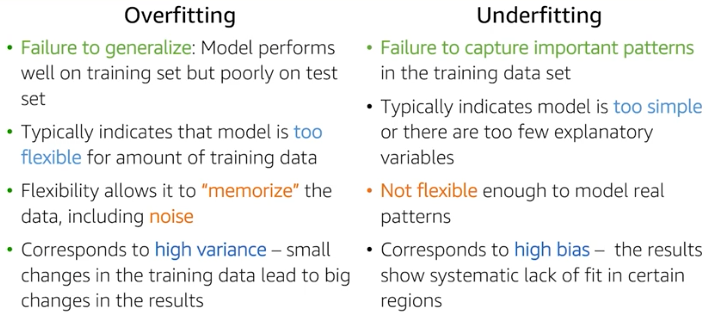
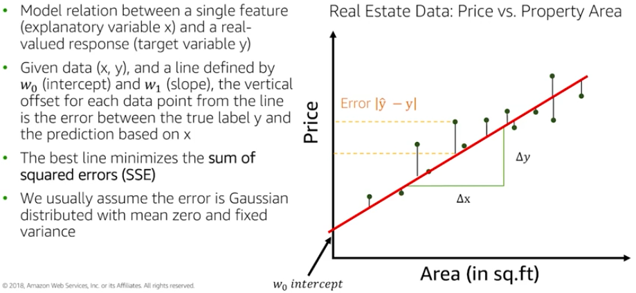

# Exam Logistics

- 170 min
- 65 questions
- Contents:
  - Data engineering - 20%
  - Exploratory data analysis - 24%
  - Modellling - 36%
  - ML implementation & operation  20%
- Type:
  - **Multiple choice**
  - **Multiple response**

建议：

- 先读题，尝试在看选项前答题。

- 找关键词（qualifier & key phrase），并根据此去掉错误选项。

- 实在不会，先跳过。

  

## Part I: Data engineering - 20%
### 1，Create data repositories for ML

数据形式[structured, unstruced] -> a centralized repository -> Data Lake

AWS Lake Formation 

Amason S3 storage option for ds processing on AWS

### 2，Identify and implement a data-ingestion solution
### 3，Identify and implement a data-transformation solution

  

## Part II: Exploratory data analysis - 24%

## Part III: Modellling - 36%

## Part IV: ML implementation & operation  20%

# ML for Business Leaders

## When & How?

### 1,when?

when is machine learning a proporate tool to solve my problem?

what can? what tools?

When not to use?

no data

no groundtruth labels

quick launch

no tolerance for error

### 2, Six questions to ask?

1, what are the made assumption?

2, what is the learning target / hypothesis? (hypothesis testing for large datasets is basic promise for ML)

3, what type of ML problem is it?

4, why did you choose this algorithm? (simpler baseline?)

5, how will you evaluate the model performance?

6, how confident are you that u can generalize the results?		

### 3, How?

how to identify ML opportunities?

**Amazon ML applications:**

recommendations

robotics optimizations

forecasting

search optimizations

delivery routes

Alexa

### 4, Define and scope a ML problem?

ML is the subfield of AI, prevalence of large data sets and massive computational resources has made the domaniance the field of AI. 

#### i,define problem

#### ii, input gathering

#### iii, output

### 5, ML Process

#### Feature Engineering domain specific 

#### Parameter Tuning

- loss function [和ground truth的差别]
- regularisation [increase the generalization to better fit the data]
- learning parameters (decay rate 控制model学习的快慢)

### Evaluation 

##### 1, Overfitting vs underfitting（generalize more toward unseen data）

- use validation error 

- using training error -> overfitting, lack of feature/information -> undercutting

##### 2, Bias-variance tradeoff [supervised]

##### 3, evaluation matrix

| 模型       | evaluation                                      |                      |
| ---------- | ----------------------------------------------- | -------------------- |
| Regression |  | -RMSE，MAPE 越大越好  -R^2 越大越好 |
| Classification | - confusion matrix   -precision recall  | - precision: how correct we are on ones we predictect would be positive   - recall: fraction of negatives that we wrongly predicted i.e. search engine; precision, quality and how relevant it is; completeness and fraction of relevance |
| Binary classification 例子 | - type I: alpha ~ 5% - type II: beta 1- power - power ~ 80% [依情况订]    - specificity = TN/TN + FP   - FPR = 1- specificity = FP/ TN + FP   | - precision：在我们判断是disease中有多少人是真的病了 - recall: 在有disease的样本量中，有多少我们可以正确的判断出来。 - accuracy: 正确判断的[overall]。  |
| ROC  AUC |  | ROC:  1, 选择不同的threshold，TPR 和 FPR 对应关系。 2, FPR越小，TPR越大。全局最优解，能接受的FPR左边能接受的点。  AUC: auc 面积越大，模型越好 |

 

### Key issues in ML

[AWS: The elements of Data Science](https://aws.amazon.com/training/learning-paths/machine-learning/exam-preparation/)

#### Data quality

consistency of the data (和问题一致么)

accuracy of the data

noisy data (fluctuation in the input and output)

missing data (那些模型对missing敏感？)

outliers 

bias

Variance

#### Model quality

overfitting and underfitting

#### Computation speed and scalability

use sagemaker and EC2 

- increase speed

- solve prediction time complexity

- solve space complexity

## Supervised learning:

### Linear methods:

#### Linear regression (univariate)

#### Multivariate LR

Multicollinearity

### Logistic regression

#### sigmoid curve

is a good representation of probability which is widely used in logistic regression to fit a model. x [-inf, inf]

#### how to fit logistic regression model

