[TOC]

# Exam Logistics

- 170 min
- 65 questions
- Contents:
  - Data engineering - 20%
  - Exploratory data analysis - 24%
  - Modellling - 36%
  - ML implementation & operation  20%
- Type:
  - **Multiple choice**
  - **Multiple response**

建议：

- 先读题，尝试在看选项前答题。

- 找关键词（qualifier & key phrase），并根据此去掉错误选项。

- 实在不会，先跳过。

[exam preparation path](https://aws.amazon.com/training/learning-paths/machine-learning/exam-preparation/)

  


## Part I: Data engineering - 20%
### 1，Create data repositories for ML

数据形式[structured, unstruced] -> a centralized repository -> Data Lake


AWS Lake Formation 

Amason S3 storage option for ds processing on AWS


### 2，Identify and implement a data-ingestion solution
### 3，Identify and implement a data-transformation solution

  

## Part II: Exploratory data analysis - 24%


## Part III: Modellling - 36%

## Part IV: ML implementation & operation  20%


# ML for Business Leaders

## When & How?

### 1,when?

when is machine learning a proporate tool to solve my problem?

what can? what tools?

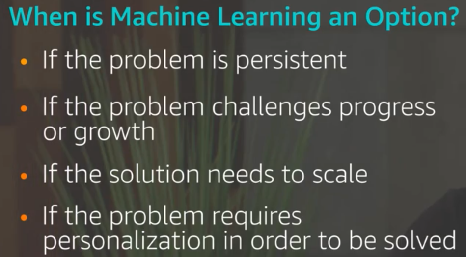

When not to use?

no data

no groundtruth labels

quick launch

no tolerance for error

### 2, Six questions to ask?

1, what are the made assumption?

2, what is the learning target / hypothesis? (hypothesis testing for large datasets is basic promise for ML)

3, what type of ML problem is it?

4, why did you choose this algorithm? (simpler baseline?)

5, how will you evaluate the model performance?

6, how confident are you that u can generalize the results?		

### 3, How?

how to identify ML opportunities?

**Amazon ML applications:**

recommendations

robotics optimizations

forecasting

search optimizations

delivery routes

Alexa

### 4, Define and scope a ML problem?

ML is the subfield of AI, prevalence of large data sets and massive computational resources has made the domaniance the field of AI. 


| i,define problem                                             | ii, input gathering                                          | iii, output                                                  |
| ------------------------------------------------------------ | ------------------------------------------------------------ | ------------------------------------------------------------ |
|  |  |  |

##  ML Process


| Feature Engineering domain specific |  |
| ----------------------------------- | ------------------------------------------------------------ |
| **Parameter Tuning**                | - loss function [和ground truth的差别]<br/>- regularisation [increase the generalization to better fit the data]<br/>- learning parameters (decay rate 控制model学习的快慢)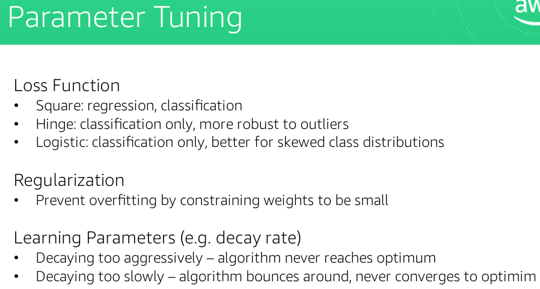 |


## Evaluation 

#### 1, Overfitting vs underfitting（generalize more toward unseen data）

- use validation error 

- using training error -> overfitting, lack of feature/information -> undercutting

#### 2, Bias-variance tradeoff [supervised]


#### 3, evaluation matrix

| 模型       | evaluation                                      |                      |
| ---------- | ----------------------------------------------- | -------------------- |
| Regression |  | -RMSE，MAPE 越大越好<br> -R^2 越大越好 |
| Classification | - confusion matrix <br/> -precision recall  | - precision: how correct we are on ones we predictect would be positive <br/> - recall: fraction of negatives that we wrongly predicted<br>i.e. search engine; precision, quality and how relevant it is; completeness and fraction of relevance |
| Binary classification 例子 | - type I: alpha ~ 5%<br/>- type II: beta 1- power<br/>- power ~ 80% [依情况订]<br/>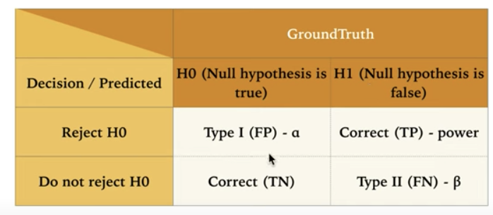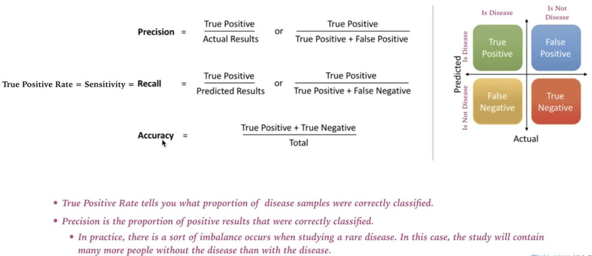 <br> - specificity = TN/TN + FP <br> - FPR = 1- specificity = FP/ TN + FP<br> \ | - precision：在我们判断是disease中有多少人是真的病了<br>- recall: 在有disease的样本量中，有多少我们可以正确的判断出来。<br>- accuracy: 正确判断的[overall]。<br> |
| ROC <br>AUC |  | ROC: <br/>1, 选择不同的threshold，TPR 和 FPR 对应关系。<br/>2, FPR越小，TPR越大。全局最优解，能接受的FPR左边能接受的点。<br/> AUC: auc 面积越大，模型越好 |

### Key issues in ML

[AWS: The elements of Data Science](https://aws.amazon.com/training/learning-paths/machine-learning/exam-preparation/)

#### Data quality

consistency of the data (和问题一致么)

accuracy of the data

noisy data (fluctuation in the input and output)

missing data (那些模型对missing敏感？)

outliers 

bias

Variance

#### Model quality

**overfitting and underfitting**


#### Computation speed and scalability

use sagemaker and EC2 

- increase speed

- solve prediction time complexity

- solve space complexity


# The elements of ML


## data collection 

### sampling 

[representivity of expected production population: unbiased]

- Random sampling
  - 问题1: rare subpopulation can be underrepresented
  - 解决1：**Stratified sampling**
    - random sampling to each subpopulation.
      - if sampling probability is not the same for each stratum, weights can be used in metrics. 
  - 问题2：
    - sensonality
      - 解决：分层抽样可以减少bias | 可视化
    - trends
      - 解决：比较不同时间段的模型结果 | 可视化
  - 问题3：
    - leakage
      - Train/test bleed: training test data 重复
      - 在train中用了但是production不用

### labeling

**Amazon Mechanical Turk** (human intelligence tasks, 人工标记问卷调查)

- plurality (assign same HIT to multiple labellers)
- gold standard hits (known labels mixed 测试标记表现)
- auditors

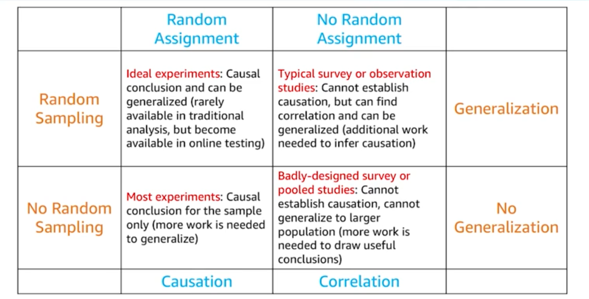

## EDA

### Data Schema

pandas merge/join

### Data Statistics

### 🌟descriptive statistics


```python
pd.describe()
pd.hist()
sns.distplot()  #有histogram + ked （smoothing拟合内核密度估计）
df['x'].value_counts()
```
#### basic plots


#### sns.distplot()

核密度估计Kernel Density Estimation(KDE)是在概率论中用来估计未知的密度函数，属于非参数检验方法之一。

直方图：密度函数是不平滑的；密度函数受子区间（即每个直方体）宽度影响很大，同样的原始数据如果取不同的子区间范围，那么展示的结果可能是完全不同的。

[核密度估计kde](https://www.jianshu.com/p/428ae3658f85)


### 🌟correlation

#### scatter | scatter_matrix

scatterplot matrix (linear relationship) - visualize attribute-target and attribute-attribute pairwise relationships.


| Scatter <br>Scatter_matrix      |  |
| ------------------------------- | --------------------------------- |
| **scatter for binary classes**  |  |
| **Correlation matrix heat map** |   <br>|
| **Pearson correlation** |  |


### Data issues

| X        |   |
| -------- | ----------------------------- |
| **x->y** |  |


## Data Processing and Feature Engineering 


### **Data Preprocessing:  Encoding Categorical Variables**

### **Data Preprocessing: Encoding Nominals**

### **Data Preprocessing: Handling Missing Values**

### **Feature Engineering**

### **Feature Engineering: Filtering and Scaling**

### **Feature Engineering: Transformation**

### **Feature Engineering: Text-Based Features**


## Model Training, Tuning, and Debugging

## Supervised learning:

### Linear methods

| Linear                                |  |
| ------------------------------------- | ------------------------------------------------------------ |
| **Linear regression (univariate)**    |  |
| **Multivariate LR** Multicollinearity |  |

### Logistic regression

|                               |  |
| ----------------------------- | ------------------------------------------------------------ |
| sigmoid curve                 | is a good representation of probability which is widely used in logistic regression to fit a model. x [-inf, inf] --> y [0 or 1]   |
| Logit function                |   The **logit** function is the inverse of the logistic function.   |
| fit logistic regression model |  |


### Neural Networks

#### Perceptron

 [input: linear, 1 layer]

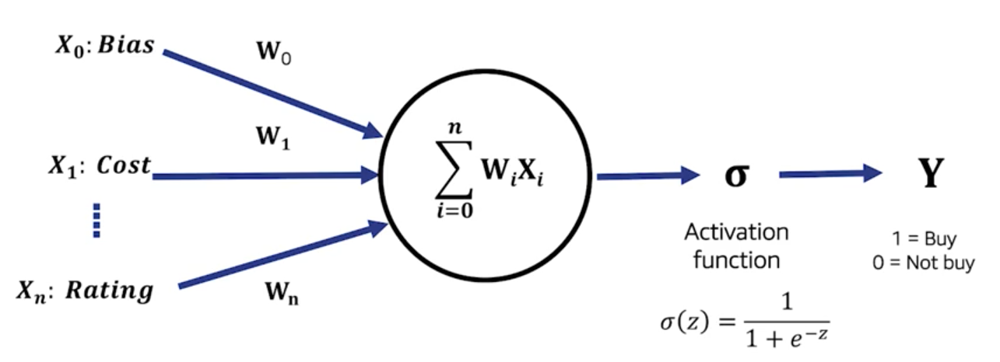

#### Neural networks

Scikit-learn: sklearn.neural_network.MLPClassifier


| 特点                                                     | Deep learning frameworks                   |
| -------------------------------------------------------- | ------------------------------------------ |
| Hard to interpret<br>expensive to train, fast to predict | PyTorch<br/>Caffe<br/>TensorFlow<br/>MXnet |

##### CNN

convolutional neural networks - classify images

卷积神经网络

power image search services, self-driving cars, automatic video classification systems
voice recognition
natural language processing

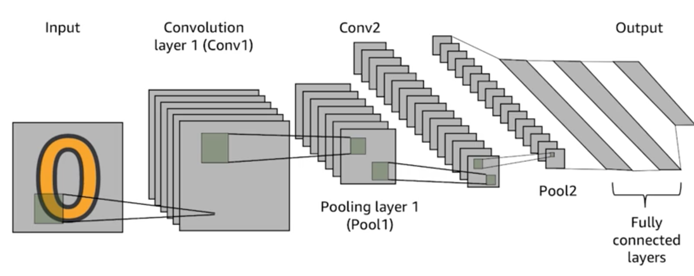

卷积层（Convolutional Layer）

[CS231n: Convolutional Neural Networks for Visual Recognition](http://cs231n.stanford.edu/)

[Introducing convolutional networks](http://neuralnetworksanddeeplearning.com/chap6.html#introducing_convolutional_networks)

Convolutional Layer: 

use kernel as features to extract local features

input image, filters to convolve with the image to create the next layer.


Pooling layer: (dimension reduction)

> Aggregate local information
>
> Produces a smaller image


>  (each resulting pixel captures some “global” information)
>
> If object in input image shifts a little, output is the same

max pooling 

avg pooling


convert tensor to vector 

Category

|                               | 输入                                     |                                                     | 输出                                                        |
| :---------------------------- | ---------------------------------------- | --------------------------------------------------- | ----------------------------------------------------------- |
| 卷积层<br>Convolutional Layer | local receptive fields <br>28 x 28 pixel | filter \|kernel过滤器 <br>receptive fields<br>5 x 5 | 激活映射 activation map <br>特征映射 feature map<br>24 x 24 |
| ReLu activation               |                                          |                                                     |                                                             |
| polling layer                 |                                          |                                                     |                                                             |

[Image convolution examples](http://neuralnetworksanddeeplearning.com/chap6.html#introducing_convolutional_networks)

##### RNN

Recurrent neural network


- for Feedforward neural network and convolutional, independent input
- Time series, language, sequencial feature

### **K-Nearest Neighbors**

|  |  |
| ---- | ---- |
| 1, Define a distance measure in the training data<br />2, Apply for new data point<br />3, Comment the observation [预测预测目标和所有样本之间的距离或者相似度]<br />4, Identify the nearst neighbors<br />5, Define the k [Small k, local observation, large k, more global]<br />6, vote | <br /> |
| 1, 简单，memory-based, instance based<br />2, 适合低纬（少features）<br />3, 预测中要循环所有样本 | 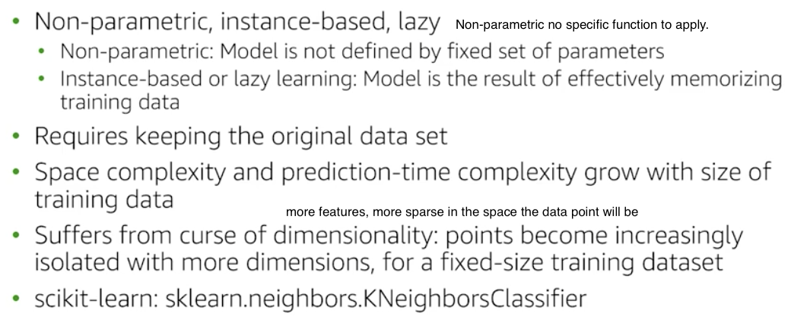 |
|  |  |


more features, more sparse in the space the data point will be

2， 重要特征的占比被削减【特征选择】| 距离算法的复杂度和向量的长度成线性关系

4，不能实时

只保留代表性样本，KD-Tree，近似的算法 LSH (牺牲一点准确度)

##### 二分问题

一般对于二分类问题来说，把K设置为奇数是容易防止平局的现象。但对于多分类来说，设置为奇数未必一定能够防平局。 

```python
from sklearn import datasets
from collections import Counter 
from sklearn.model_selection import train_test_split
import numpy as np

# 导入iris数据
iris = datasets.load_iris()
X = iris.data
y = iris.target
X_train, X_test, y_train, y_test = train_test_split(X, y, random_state=2003)

def euc_dis(instance1, instance2):
    """
    计算两个样本instance1和instance2之间的欧式距离
    instance1: 第一个样本， array型
    instance2: 第二个样本， array型
    """
    dist = np.sqrt(sum((instance1 - instance2)**2))
    return dist
    
    
def knn_classify(X, y, testInstance, k):
    """
    给定一个测试数据testInstance, 通过KNN算法来预测它的标签。 
    X: 训练数据的特征
    y: 训练数据的标签
    testInstance: 测试数据，这里假定一个测试数据 array型
    k: 选择多少个neighbors? 
    """
    # 返回testInstance的预测标签 = {0,1,2}
    distances = [euc_dis(x, testInstance) for x in X]
    kneighbors = np.argsort(distances)[:k]
    count = Counter(y[kneighbors])
    return count.most_common()[0][0]

# 准确率    
predictions = [knn_classify(X_train, y_train, data, 3) for data in X_test]
correct = np.count_nonzero((predictions==y_test)==True)
print ("Accuracy is: %.3f" %(correct/len(X_test)))
```

##### 4 点需要注意

1, X -- Feature Engineering

2,  需要提前样本标注

3, 计算2个物体之间的相似度

- 欧氏距离 *Euclidean distance*

4, 选择合适的K

- 决策边界：拥有线性决策边界的模型我们称为线性模型，反之非线性模型。
  - 线性分类器
  - 非线性分类器
- 模型的泛化能力

[k 自信的程度，k = 1 近的人是A 抄作业 1个就够， 旁边都是B 需要更多的K]

collaborative filtering. -- 

##### KNN的决策边界

-  随着K值的增加，决策边界确实会变得更加平滑，从而模型变得更加稳定。

- 但稳定不代表，这个模型就会越准确。
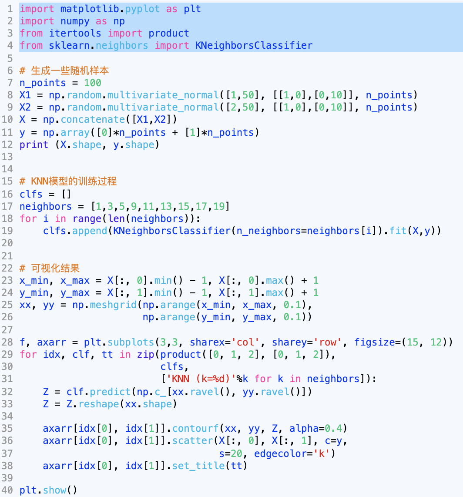
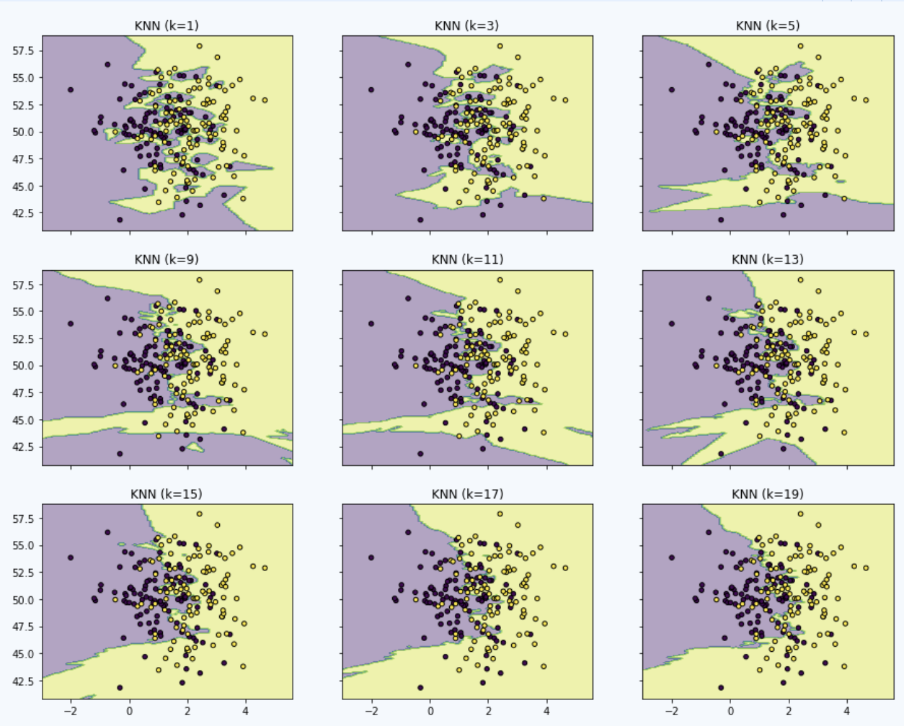

##### 交叉验证

将数据分成训练数据和验证数据，选择在验证数据里最好的超参数。

*K-fold Cross Validation* K折交叉验证：已有的数据上重复做多次的验证

- 针对不同的K值，逐一尝试从而选择最好的
- 数据量较少的时候我们取的K值会更大
- 极端情况：*leave_one_out* 留一法交叉验证，也就是每次只把一个样本当做验证数据，剩下的其他数据都当做是训练样本。

###### 自己写

```python

from sklean.model_selection import KFold
from sklean.neighbors import KNeighborsClassifier

ks = [1,3,5,7,9,11,13,15]
kf = KFold(n_splits = 5, randon_state = True, shuffle = True)

best_k = ks[0]
best_score = 0

for k in ks:
  curr_score = 0
  for train_idx, valid_idx in kf.split(X):
    clf = KNeighborsClassifier(n_neighbors =k)
    clf.fit(X[train_idx], y[train_idx])
    curr_score = curr_score + clf.score(X[valid_idx],y[valid_idx])
  avg_score = curr_score/5
  if avg_score > best_score:
    best_k = k
    best_score = avg_score
  print("current best score is %.2f"%best_score, "best k: %d"%best_k)
print("after cross validation, the final best k is: %d"%best_k)
  

```
###### GridSearch


```python
from sklean.model_selection import GridSearchCV
from sklean.neighbors import KNeighborsClassifier

parameters = {'n_neighbors':[1,3,5,7,9,11,13,15]} #knn 的参数
knn = KNeighborsClassifier() #不用指定参数
#GridSearchCV来搜索最好的k。模块内部对每个k值都做了评估

clf = GridSearchCV(knn, parameters, cv = 5)
clf.fit(X,y)

print("best score is: %.2f"%clf.best_score_, " best param: ", clf.best_params_)

```

K: 

- 对于KNN来讲，我们一般从K=1开始尝试，但不会选择太大的K值。而且这也取决于计算硬件，因为交叉验证是特别花时间的过程，因为逐个都要去尝试
- 提高效率：并行化、分布式的处理。针对于不同值的交叉验证之间是相互独立的，完全可以并行化处理。

**我们绝对不能把测试数据用在交叉验证的过程中**

##### 特征缩放

- 特征值上的范围的差异对算法影响非常大。
- 标准化的操作，也就是把特征映射到类似的量纲空间，目的是不让某些特征的影响变得太大。

###### Min-max Normalization

线性归一化：把特征值的范围映射到[0,1]区间


###### Z-score Normalization

标准差归一化：特征值映射到均值为0，标准差为1的正态分布


##### 图像识别Knn

http://www.cs.toronto.edu/~kriz/cifar.html

图片是由像素来构成的，比如256*256或者128*128。两个值分别代表长宽上的像素。这个值越大图片就会越清晰。另外，对于彩色的图片，一个像素点一般由三维数组来构成，分别代表的是R,G,B三种颜色。除了RGB，其实还有其他常用的色彩空间。如果使用RGB来表示每一个像素点，一个大小为128*128像素的图片实际大小为128*128*3，是一个三维张量的形式。

图像的读取及表示：

```python
import matplotlib.pyplot as plt

img = plt.imread('.jpg')
print(img.shape)
plt.imshow(img)
```

图像识别挑战：环境因素 （拍摄角度，图像亮度，遮挡物）

1，图像上的特征工程

- 颜色特征（color histogram） 
- SIFT（scale-invariant feature transform）：一个局部的特征，它会试图去寻找图片中的拐点这类的关键点，然后再通过一系列的处理最终得到一个SIFT向量。
- HOG（Histogram of Oriented Gradient）：通过计算和统计图像局部区域的梯度方向直方图来构建特征。由于HOG是在图像的局部方格单元上操作，所以它对图像几何的和光学的形变都能保持很好的不变性。

2， 图像降维

- 这种降维操作会更好地保留图片中重要的信息，同时也帮助过滤掉无用的噪声。
- PCA ：对数据做线性的变换，然后在空间里选择信息量最大的Top K维度作为新的特征值。

##### 缺失值

1，删除：70%缺失值，删除column

2，补平

##### 特征编码feature encoding

###### categorical

- 字符串转换成数值类型

Label encoding 标签编码:一个类别表示成一个数值，比如0，1，2，3….

one-hot encoding 独热编码


###### Integer 数值型

标准化操作

离散化操作 Discretization


阈值的确定：保证各个区间的样本个数是类似的

1，增加模型的非线性型

2，有效处理理数据分布的不均匀的特点。

##### Ordinal顺序

每一种值都有大小的关系，也就是程度上的好坏之分


#### 二：回归问题


1，特征处理

2， Corr() 计算特征之间的相关性。

3，这里StandardScaler用来做特征的归一化，把原始特征转换成均值为0方差为1的高斯分布。

特征的归一化的标准一定要来自于训练数据，之后再把它应用在测试数据上。

4，以及用KNN模型做预测，并把结果展示出来。这里我们使用了y_normalizer.inverse_transform，因为我们在训练的时候把预测值y也归一化了，所以最后的结论里把之前归一化的结果重新恢复到原始状态。 在结果图里，理想情况下，假如预测值和实际值一样的话，所有的点都会落在对角线上，但实际上现在有一些误差。


#### 三： 复杂度分析以及KD树

KNN在搜索阶段的时间复杂度是多少？

- 假如有N个样本，而且每个样本的特征为D维的向量。那对于一个目标样本的预测，需要的时间复杂度是O(ND)
- 如何提升？
  - 1，时间复杂度高的根源在于样本数量太多。所以，一种可取的方法是从每一个类别里选出具有代表性的样本。如：对于每一个类的样本做**聚类**，从而选出具有一定代表性的样本。
  - 2， 可以使用近似KNN算法。算法仍然是KNN，但是在搜索的过程会做一些近似运算来提升效率，但同时也会牺牲一些准确率。https://www.cs.umd.edu/~mount/ANN/
  - 3，使用KD树来加速搜索速度
    - KD树看作是一种数据结构，而且这种数据结构把样本按照区域重新做了组织，这样的好处是一个区域里的样本互相离得比较近。
    -   
    - KD树之后，我们就可以用它来辅助KNN的搜索了
      -   为了保证能够找到全局最近的点，我们需要适当去检索其他区域里的点，这个过程也叫作Backtracking。
    - 
       - 最坏情况：backtracking 了所有的节点
         - 


#### 四：带权重的knn


### **Supervised Learning: Linear and Non-Linear Support Vector Machines**

### **Supervised Learning: Decision Trees and Random Forests**

### Model Training: Validation Set

### **Model Training: Bias Variance Tradeoff**

### **Model Debugging: Error Analysis**

### **Model Tuning: Regularization**

### **Model Tuning: Hyperparameter Tuning**

### **Model Tuning**

### **Model Tuning: Feature Extraction**

### **Model Tuning: Feature Selection**

### **Model Tuning: Bagging/Boosting**


# Math

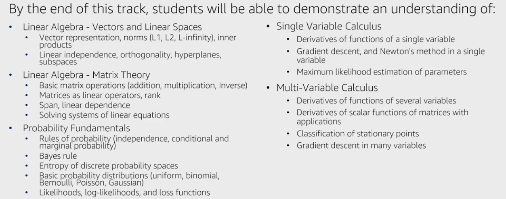