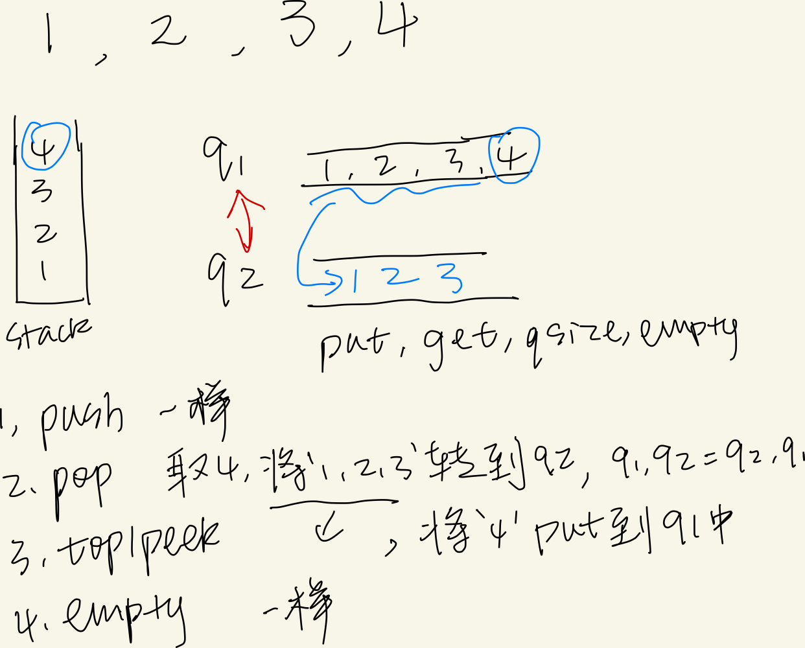
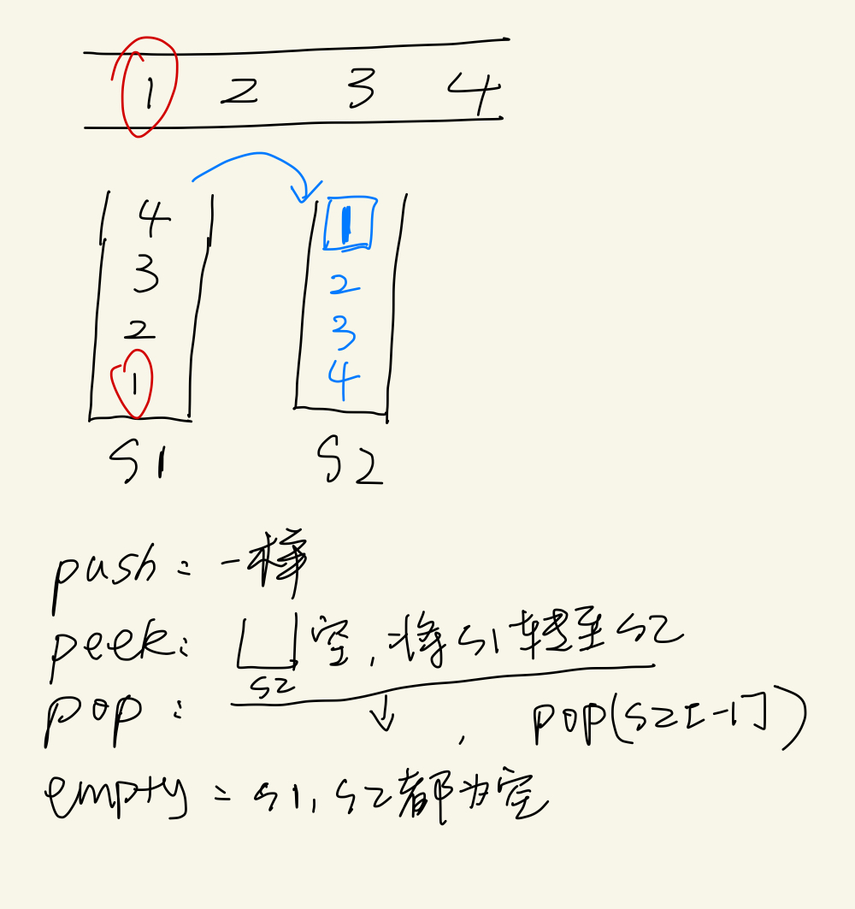

title: "队列实现栈|栈实现队列"
date: 2020-03-29
tags: [[队列实现栈|栈实现队列](https://github.com/labuladong/fucking-algorithm/blob/master/%E6%95%B0%E6%8D%AE%E7%BB%93%E6%9E%84%E7%B3%BB%E5%88%97/%E9%98%9F%E5%88%97%E5%AE%9E%E7%8E%B0%E6%A0%88%E6%A0%88%E5%AE%9E%E7%8E%B0%E9%98%9F%E5%88%97.md)，[225. Implement Stack using Queues](https://leetcode.com/problems/implement-stack-using-queues/)]

### 1，队列实现栈
---
<!--栈：push(), pop(), top(), isempty()
	  队列：put(), get(), qsize(), empty()-->



### 分析

```python
from queue import Queue
#put, get, qsize, empty

class MyStack:

    def __init__(self):
        """
        Initialize your data structure here.
        """
        self.queue1 = Queue()
        self.queue2 = Queue()
        
    def push(self, x: int) -> None:
        """
        Push element x onto stack.
        """
        return self.queue1.put(x)
        
    def pop(self) -> int:
        """
        Removes the element on top of the stack and returns that element.
        """
        while self.queue1.qsize() > 1:
            self.queue2.put(self.queue1.get())
        item = self.queue1.get()  
        self.queue1, self.queue2 = self.queue2, self.queue1
        return item

    def top(self) -> int:
        """
        Get the top element.
        """
        while self.queue1.qsize() > 1:
            self.queue2.put(self.queue1.get())
        item = self.queue1.get()  
        self.queue1, self.queue2 = self.queue2, self.queue1
        self.queue1.put(item)
        return item

    def empty(self) -> bool:
        """
        Returns whether the stack is empty.
        """
        return self.queue1.empty()

# Your MyStack object will be instantiated and called as such:
# obj = MyStack()
# obj.push(x)
# param_2 = obj.pop()
# param_3 = obj.top()
# param_4 = obj.empty()
```


### 2，队列实现栈

---


```python
class MyQueue:

    def __init__(self):
        """
        Initialize your data structure here.
        """
        self.stack1 = []
        self.stack2 = []
        
    def push(self, x: int) -> None:
        """
        Push element x to the back of queue.
        """
        self.stack1.append(x)
        
    def pop(self) -> int:
        """
        Removes the element from in front of queue and returns that element.
        """
        self.peek()
        return self.stack2.pop()

    def peek(self) -> int:
        """
        Get the front element.
        """
        if not self.stack2:
            while self.stack1:
                self.stack2.append(self.stack1.pop())
        return self.stack2[-1]

    def empty(self) -> bool:
        """
        Returns whether the queue is empty.
        """
        return not self.stack1 and not self.stack2
        
# Your MyQueue object will be instantiated and called as such:
# obj = MyQueue()
# obj.push(x)
# param_2 = obj.pop()
# param_3 = obj.peek()
# param_4 = obj.empty()
```


