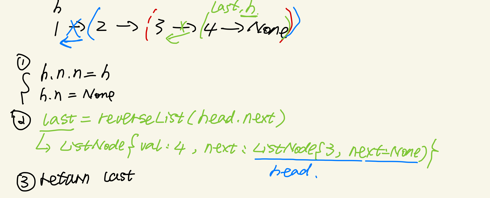
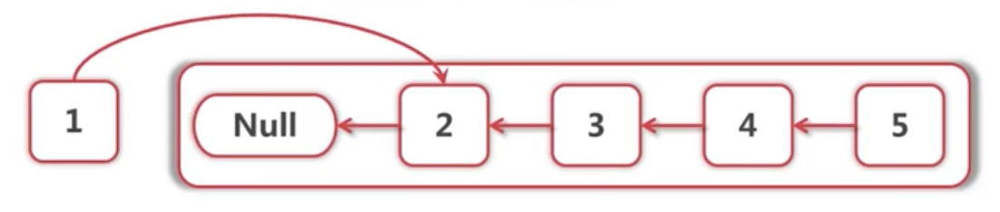
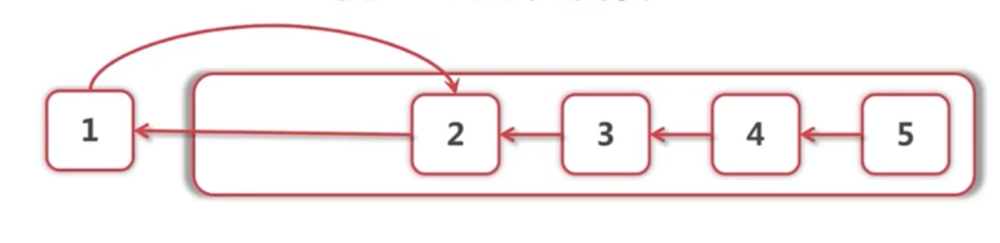
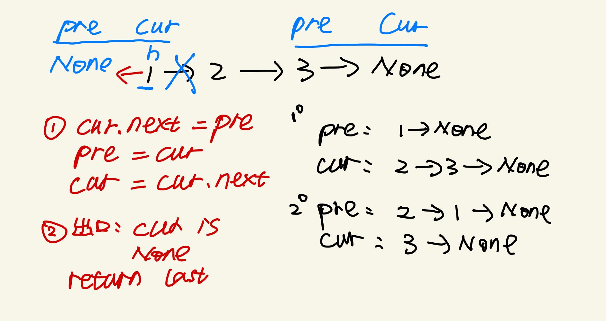
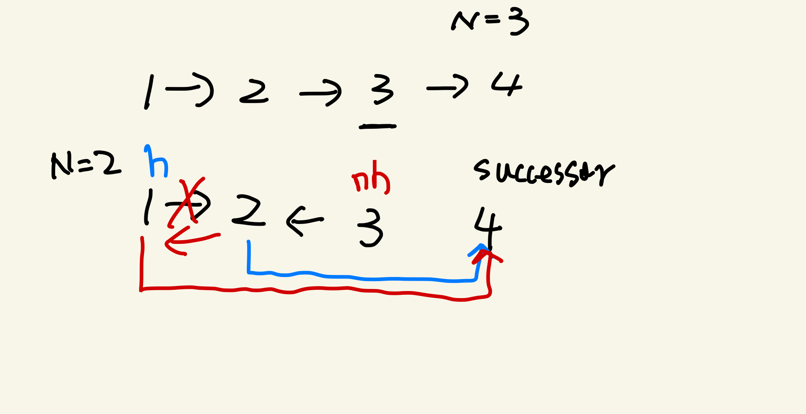

title: "反转链表"
date: 2020-03-29
tags: [反转链表， [206. Reverse Linked List](https://leetcode.com/problems/reverse-linked-list/)]

### 1，反转链表-递归法

---
```python
Input: 1->2->3->4->5->NULL
Output: 5->4->3->2->1->NULL
```

##### 分析


1, 假设已经反转好了:


```python
newHead = self.reverseList(head.next)
```

2, 那要做的就是讲`head.next.next` 从`None`指向自己,head` 指向 `None`


```python
head.next.next = head
```
3, 逐行判断base case

```python
if not head:
	return None
# 因为要set head.next.next
if not head.next:
	return head
```
4, In the end
```python
def reverseList(head):
    if not head:
    	return null
    if not head.next:	
    	return head
    newHead = self.reverseList(head.next)
    head.next.next = head
    head.next = None
    return newHead
```

归纳后版本

```python
# Definition for singly-linked list.
# class ListNode:
#     def __init__(self, x):
#         self.val = x
#         self.next = None

class Solution:
    def reverseList(self, head: ListNode) -> ListNode:
        if not head or not head.next:
            return head
        newHead = self.reverseList(head.next)
        head.next.next = head
        head.next = None
        return newHead
```
---
### 2，反转链表-非递归

---


```python
class Solution:
    def reverseList(self, head: ListNode) -> ListNode:
        cur, prev = head, None
        while cur:
            cur.next, prev, cur = prev, cur, cur.next
        return pre
```
---
### 3，反转前 N 个节点
---

在这之前先回顾一下节点的基本操作:

1， ListNode, get(loc),add(loc, val),set(loc, val),remove(loc), traverse, is_empty

```python
class ListNode:

    def __init__(self, val):
        self.val = val
        self.next = None


class MyLinkedList:

    def __init__(self):
        self.head = None

    def get(self, location):
        cur = self.head
        for i in range(location):
            cur = cur.next
        return cur.val

    def add(self, location, val):
        if location > 0:
            pre = self.head
            for i in range(location - 1):
                pre = pre.next
            new_node = ListNode(val)
            new_node.next = pre.next
            pre.next = new_node
        elif location == 0:
            new_node = ListNode(val)
            new_node.next = self.head
            self.head = new_node

    def set(self, location, val):
        cur = self.head
        for i in range(location):
            cur = cur.next
        cur.val = val

    def remove(self, location):
        if location > 0:
            pre = self.head
            for i in range(location - 1):
                pre = pre.next

            pre.nextw = pre.next.next

        elif location == 0:
            self.head = self.head.next

    def traverse(self):
        cur = self.head
        while cur is not None:
            print(cur.val, end=' ')
            cur = cur.next
        print()

    def is_empty(self):
        return self.head is None   
```

2，



```python
def reverseFirstN(head, N):
    successor = ListNode(0)
    return reverseFristNHelper(head,N,successor)
    
#反转以 head 为起点的 n 个节点，返回新的头结点
def reverseFristNHelper(head,N,successor):
    if N ==1:
    		#记录继承者
        successor.next = head.next
        return head
    #以head.next为起点，反转前n-1个节点    
    newNode = reverseFristNHelper(head.next,N-1,successor)
    head.next.next = head
    head.next = successor.next
    return newNode
```

---

### 3，反转前 （M，N） 个节点

---

1，m = 1 就是反转 `reverseFirstN`

2，m !=1, head一直前进到反转的起点触发base case

```python
def reverseBetween(head, m ,n):
	if m = 1:
    reverseFirstN(head, n)
  head.next = reverseBetween(head.next,m-1,n-1)
  return head
```


---


