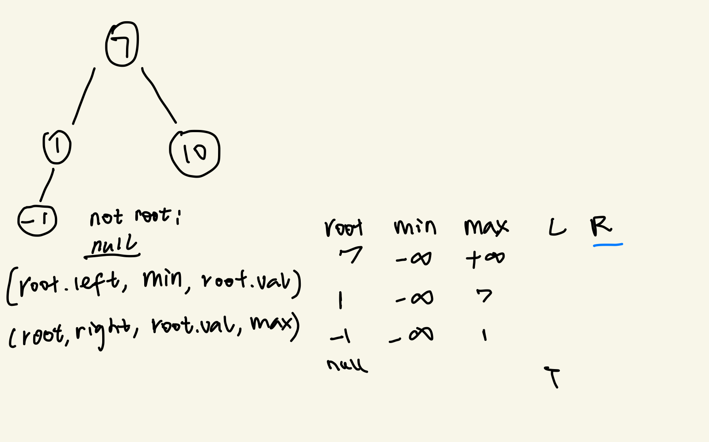

title: "二叉树的套路"
date: 2020-03-31 
tag: 

- [701. Insert into a Binary Search Tree](https://leetcode.com/problems/insert-into-a-binary-search-tree/)
- [98. Validate Binary Search Tree](https://leetcode.com/problems/validate-binary-search-tree)


### 1，前序中序后续遍历二叉树
---
<!--二叉树算法的设计的总路线：明确一个节点要做的事情，然后剩下的事抛给框架。
-->

### 分析
```python
class TreeNode:
    def __init__(self, val):
        self.val = val
        self.left = None
        self.right = None
        
def Traverse(root):
    if not root:
        return
    print(root.val) #preorder 前序 root - left - right
    inorderTraverse(root.left)
    print(root.val) #inorder 中序  left - root - right
    inorderTraverse(root.right)
    print(root.val) #postorder 后序  left - right - root
```


### 2，BFS - Breadth-first search 宽度优先遍历

---


### 3，BST常用操作

---
#### BST 插入

 

```python
class BST:
    def __init__(self):
        self.__root = None
    def add(self, val):
        self.__root = self.__add_helper(self.__root, val)
    def __add_helper(self, root, val):
        if not root:
            return TreeNode(val)
        if val < root.val:
            root.left = self.__add_helper(root.left, val)
        else:
            root.right = self.__add_helper(root.right, val)

        return root
```

####LC 701
[701. Insert into a Binary Search Tree](https://leetcode.com/problems/insert-into-a-binary-search-tree/)
```python
class Solution:
    def insertIntoBST(self, root: TreeNode, val: int) -> TreeNode:
        if not root:
            return TreeNode(val)
        if val < root.val:
            root.left = self.insertIntoBST(root.left, val)
        else:
            root.right = self.insertIntoBST(root.right, val)
        return root    
```

#### BST 查找

- 时间复杂度：O(h)
- 空间复杂度：O(h)


```python
def contains(self, val):
        return self.__contains_helper(self.__root, val)

    def __contains_helper(self, root, val):
        if not root:
            return False
        if root.val == val:
            return True
        elif val < root.val:
            return self.__contains_helper(root.left, val)
        else:
            return self.__contains_helper(root.right, val)
```


### 4，合法的二叉查找树

---

#### LC98

[98. Validate Binary Search Tree](https://leetcode.com/problems/validate-binary-search-tree)

##### 递归做法

   

```python
class Solution:
    def isValidBST(self, root, floor=float('-inf'), ceiling=float('inf')):
        if not root: 
            return True
        if root.val <= floor or root.val >= ceiling:
            return False
        # in the left branch, root is the new ceiling; contrarily root is the new floor in right branch
        return self.isValidBST(root.left, floor, root.val) and self.isValidBST(root.right, root.val, ceiling)
```


---
105. Construct Binary Tree from Preorder and Inorder Traversal

     https://leetcode.com/problems/construct-binary-tree-from-preorder-and-inorder-traversal/

---


### [图片来源](https://github.com/labuladong/fucking-algorithm/blob/master/数据结构系列/单调栈.md)

