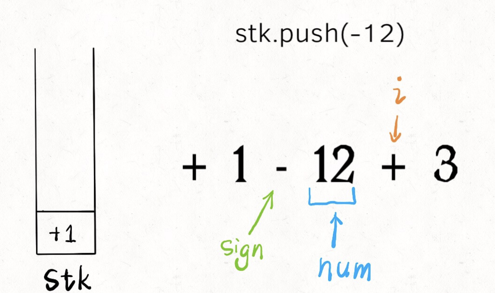

title: "实现计算器"
date: 2020-03-27 

tags: [DataStructure, LC224]
---

### 实现计算器
---
这里是描述
<!--more-->

### 1，字符串转整数
---
```python
def string2integer(string):
    num = 0
    for i in range(len(string)):
        num = num * 10 + (ord(string[i]) - ord('0'))
    return num    
```

### 2，处理加减法
---
**算式只包含加减法，而且不存在空格**

`1-12+3`

- 首个加`+`
- 碰到数字则追加到number尾端
- 碰到符号或者**s循环到最后**
  - `+` push `num`
  - `-`  push `-num`
  - `sign` 更新为 `s[i]`，num记录下个数字

```python
def calculator(s: str) -> int:
    stack =[]
    sign = '+'
    num = 0
    for i in range(len(s)):
        if s[i].isdigit():
            num  = num *10 + int(s[i])
        if not s[i].isdigit() or i == len(s)-1:
            if sign == '+':
                stack.append(num)
            elif sign == '-':
                stack.append(-num)
            sign = s[i]
            num = 0    
    return(sum(stack)) 
```


### 3，处理乘除法

---
拿出前一个数做运算。

```python
def calculator(s: str) -> int:
    stack =[]
    sign = '+'
    num = 0
    for i in range(len(s)):
        if s[i].isdigit():
            num  = num *10 + int(s[i])    
        if (not s[i].isdigit() and not s[i].isspace()) or i == len(s)-1:
            if sign == '+':
                stack.append(num)
            elif sign == '-':
                stack.append(-num)
            elif sign == '*':
                stack[-1] = stack[-1] * num
            elif sign == '/':
                stack[-1] = stack[-1] / num
            sign = s[i]
            num = 0    
    return(sum(stack))     
```


### 4，加括号

---

括号包含的算式，我们直接视为一个数字就行了。

递归的开始条件和结束条件是什么？**遇到`(`开始递归，遇到`)`结束递归**


---

### [题目来源]([https://github.com/labuladong/fucking-algorithm/blob/master/%E6%95%B0%E6%8D%AE%E7%BB%93%E6%9E%84%E7%B3%BB%E5%88%97/%E5%AE%9E%E7%8E%B0%E8%AE%A1%E7%AE%97%E5%99%A8.md](https://github.com/labuladong/fucking-algorithm/blob/master/数据结构系列/实现计算器.md))

