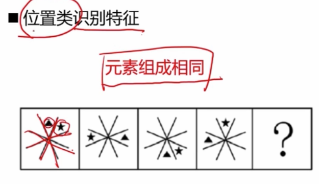
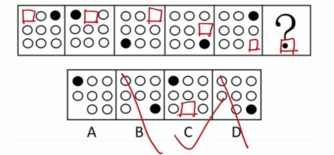
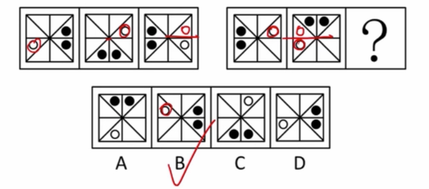
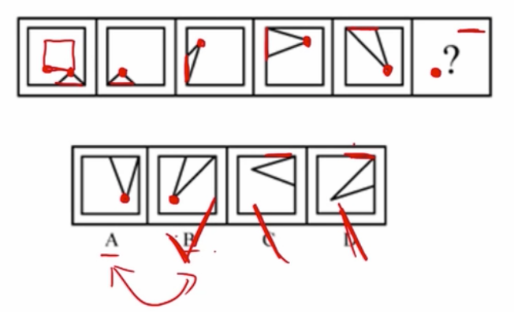
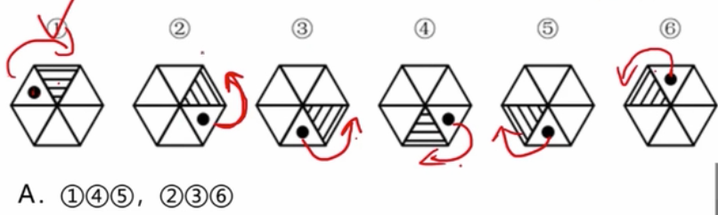

## 图形推理

[刘文超](https://www.bilibili.com/video/BV12t4115735?from=search&seid=12328596785628959866)

### 1，元素组成一样，位置移动

#### 考点一：平移

- 方像3：直线，绕圈
- 移动步数：恒定，递增

星：顺时针5位，三角形：逆时针6位

黑色逆时针走2步，白色顺时针走一步

黑色顺时针，白色先中心对称再轴对称

底边顺时针，三角形的顶点也在顺时针转

顺时针，逆时针

